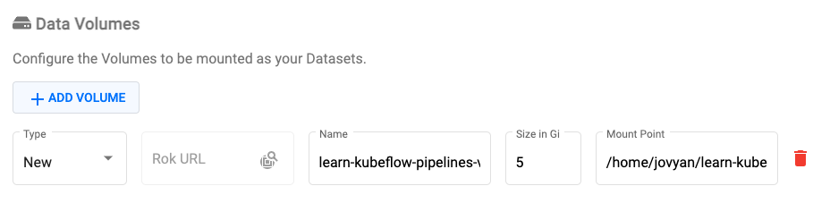
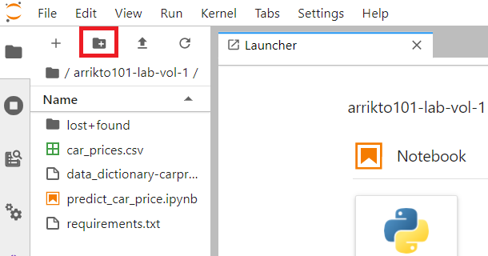
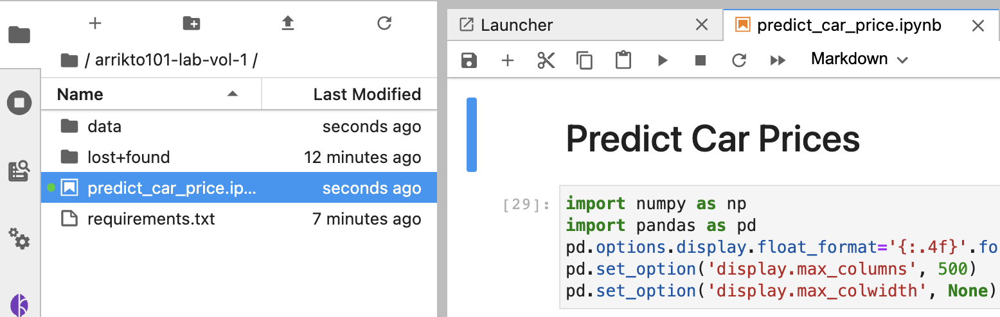
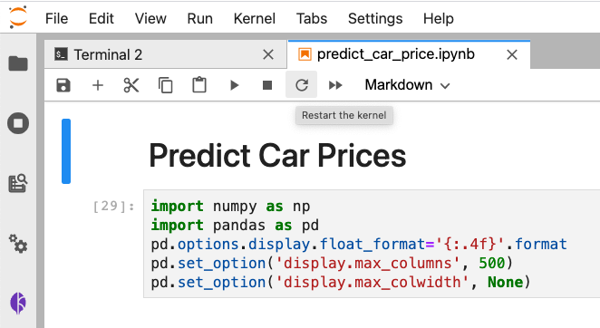
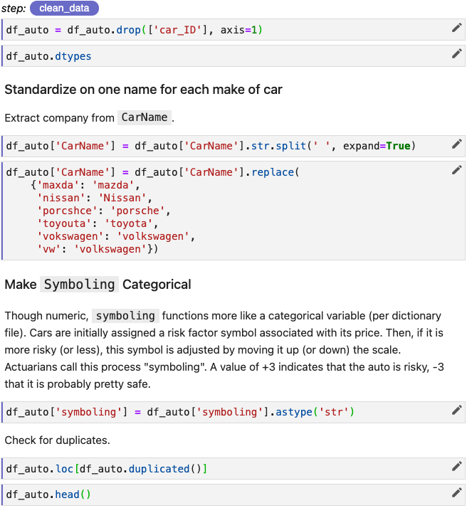
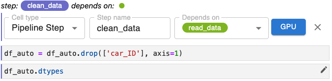
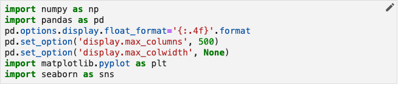
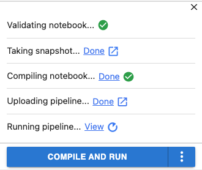

# **Arrikto 101**: Instructor Led Labs 

## Prepare MiniKF
To work with a notebook in Kubeflow we first need to launch a notebook server. To do this, follow the steps below.

### 1. View the Home screen in your MiniKF Kubeflow deployment.  

{: style="display: block; margin: auto; width:80%"}

### 2. Select the Notebooks pane from the main navigation menu.

{: style="display: block; margin: auto; width:80%"}

You will see the Notebook Servers dashboard. Unless you have already launched one or more notebook servers, your dashboard will be empty. 

{: style="display: block; margin: auto; width:80%"}

### 3. Click the *NEW SERVER* button.

{: style="display: block; margin: auto; width:80%"}

Once you have clicked NEW SERVER, a form will appear that will enable you to provide the settings for your notebook server.

{: style="display: block; margin: auto; width:80%"}

### 4. Enter a name.

In the Name field enter arrikto101-lab

### 5. Add a data volume.

Scroll down to the Data Volumes field. Add a data volume. The field values will auto-complete. You do not need to make any changes to the field values set for you.

{: style="display: block; margin: auto; width:80%"}

### 6. Click the *LAUNCH* button.

Scroll to the bottom of the form and click the *LAUNCH* button to create your notebook server.

{: style="display: block; margin: auto; width:80%"}

### 7. Connect to your notebook server.

To connect to the notebook server you’ve just created, click the *CONNECT* button in the Notebook Servers dashboard.

{: style="display: block; margin: auto; width:80%"}

Once you connect, you will see the Jupyter notebooks server user interface with an open file browser pane and launcher tab. 

## Environment Preparation
Now that you have a Notebook Server set up you need to download and add the relevant handout files to the Notebook Server. 

### 1. Review the handout files


{: style="display: block; margin: auto; width:80%"}

`car_prices.csv` is our data file.

`data_dictionary-carprices.xlsx` provides some explanatory detail on our
dataset.

`predict_car_price.ipynb` is a notebook containing Python code that builds and
evaluates three models for predicting car prices based on our dataset. We will
modify the code in small ways and annotate this notebook to define and run a
Kubeflow pipeline!

`requirements.txt` lists the Python modules required for our notebook. We'll
use this file to install those requirements in a later step.

### 2. Open the arrikto101-lab folder

Double-click on the directory, `arrikto101-lab`.


{: style="display: block; margin: auto; width:80%"}

### 3. Click the file upload button


{: style="display: block; margin: auto; width:80%"}

### 4. Upload handout files

 In the file dialog that pops up, select the three handout files you unzipped
 and upload them to your Jupyter notebook environment.


{: style="display: block; margin: auto; width:80%"}

You will see them appear in the `arrikto101-lab` directory.


{: style="display: block; margin: auto; width:80%"}

### 5. Create a new folder

Click the button to create a new folder.


{: style="display: block; margin: auto; width:80%"}

### 6. Name the folder "data"


{: style="display: block; margin: auto; width:80%"}

### 7. Move data files

Drag and drop `car_prices.csv` and `data_dictionary-carprices.xlsx` into the
data folder.


{: style="display: block; margin: auto; width:80%"}

### 8. Open our notebook

Double-click `predict_car_price.ipynb` in the file browser pane.


{: style="display: block; margin: auto; width:80%"}

### 9. Enable Kale

Click the *Enable* toggle in the *Kale Deployment panel* to enable Kale.


{: style="display: block; margin: auto; width:80%"}

### 10. Launch a Terminal

Click the *Launcher* tab and launch a terminal.


{: style="display: block; margin: auto; width:80%"}

### 11. Install Requirements

In the terminal install the Python modules required by this notebook.

`pip install -r requirements.txt`


{: style="display: block; margin: auto; width:80%"}

### 12. Restart the Kernel

In the `predict_car_price.ipynb` notebook, restart the kernel.


{: style="display: block; margin: auto; width:80%"}

## Creating Pipeline w/ Kale
Now that you are set up you will practice tagging cells with Kale to generate and automatically launch a pipeline in Kubeflow. You will first set up your initial pipeline steps - `prep_data` and `clean_data`.

### 1. Isolate the code for your step in one cell

Modify your code so that the line that reads the car_prices.csv file is in a
cell by itself.

{: style="display: block; margin: auto; width:80%"}

### 2. Annotate the cell as a *Pipeline Step* and name it

Click the pencil icon on that cell and set the *Cell type* to *Pipeline Step*
and the *Step name* to `read_data`.

{: style="display: block; margin: auto; width:80%"}

Click the x to close the annotation editor.

Note that in addition to the label, `read_data`, this cell of our pipeline is
now marked with a vertical line that is the same color as the background of
the label, `read_data`.

If you look more closely, you’ll see that, in fact, all cells below this first
cell have been marked with a vertical line of the same color. 

The default behavior for Kale is that it automatically includes the cells that
follow a step cell as part of the same step until you specify otherwise by
supplying annotations later in the notebook.

In its current state, our entire notebook after the cell in which we read the
`car_prices.csv` file is a single pipeline step. Obviously, we don’t want the
entire notebook to be a single-step pipeline, but this Kale behavior does
provide an important convenience as we’ll see in a moment.

Let’s define the second step of our pipeline. As we did before, we need to annotate
a cell with the *Pipeline Step* label. In situations like this where the step is
composed of multiple cells, you’ll want to ensure that all cells are annotated
accordingly.

### 3. Annotate the *Clean Data* step
Annotate the first cell of the data cleaning step and name this step `clean_data`.
The remaining cells for this step will be included in this annotation. If you can’t
remember exactly how to annotate a cell, see the example for `read_data` above or
review the Kale documentation.

When you have finished annotating `clean_data`, that portion of your notebook should
look like the following.

{: style="display: block; margin: auto; width:80%"}

In order to define a pipeline you need to identify not just the code that makes
up the step, but also specify the order in which the steps of your pipeline
should execute. To do this, select which step (or steps) should immediately
precede the step you are annotating by using the Depends on pull-down menu. The step `clean_data` relies on `read_data` to read our dataset into a `pandas`
data frame (`df_auto`) so we need to define that relationship and establish the
sequence in which these two steps should execute.

{: style="display: block; margin: auto; width:80%"}

With the work we’ve done so far, we now have a two-step pipeline that we can
summarize as follows.

### 4. Organize Pipeline Modelling Steps
Besides the first cell in the notebook, let’s review where else we have
imports in the cells leading up to the Modeling section. There are two
cells in the *Visualize Data* section that include imports. They are as
follows.


{: style="display: block; margin: auto; width:80%"}


{: style="display: block; margin: auto; width:80%"}

Move these imports so that they are together with the others in the
first cell of our notebook. Notice we've done that, the first cell in our
notebook will look something like this.


{: style="display: block; margin: auto; width:80%"}

The modified cells in the *Visualize Data* section should look something like
this.


{: style="display: block; margin: auto; width:80%"}


{: style="display: block; margin: auto; width:80%"}

Now, let’s apply the Imports annotation to the cell containing our reorganized imports.


{: style="display: block; margin: auto; width:80%"}

Review all cells in the Modeling section of our notebook and make the following changes:

1. Create a cell just below the “Modeling” header.
2. Move all the import statements below this point in the notebook into the new cell you’ve just created.
3. Annotate the new cell you created as an Imports cell.

### 5. Skip `read_data` and `clean_data` Cells
In their current form, our `read_data` and `clean_data` steps both contain a 
number of lines of code that generate diagnostic output or do other work that
is not core to the work of those steps. For pipeline runs, we don’t want to
include this code, because it will add unnecessary compute cycles and
execution time.


{: style="display: block; margin: auto; width:80%"}

We can keep this code in our notebook where it will be of use as we continue
to develop our models, but explicitly exclude it from pipeline steps. To do
this, we need to make sure that all the statements to be excluded are in
separate cells from the code that is core to pipeline steps. Then, we can
apply the *Skip Cell* annotation to these cells.

For the `read_data` step, we’ll want to skip the calls to `df.auto.head()` and
`df.auto.describe()`. To do this, edit each cell and select *Skip Cell* from the
*Cell type* pull down menu. When you’ve done this successfully, your `read_data` step will look something
like the figure below.


{: style="display: block; margin: auto; width:80%"}

Update the cells in the *Clean Data* section of our notebook so that cells
not necessary for cleaning data will be excluded from the `clean_data` pipeline
step. 

### 6. Skip Visualization Sections
The Visualize Data section of this notebook informs how we build models. It
is what we used to identify the significant independent variables in this
dataset as reflected in this portion of the notebook.


{: style="display: block; margin: auto; width:80%"}

We use the outcome of our analysis to define the list `sig_col` near the top of
the *Modeling* section. We don’t need to run the cells in the *Visualize Data*
section as part of our pipeline, though we should keep this section in the
notebook because, as is the case with most projects of this nature, we will
likely need to refine our models further and want to return to a visualization
and analysis phase in a future iteration.

To keep the Visualize Data section in the notebook, but also have Kale ignore
it, we need to annotate all the cells in this section as *Skip Cells* just like
we did for the diagnostic cells in the two pipeline steps we’ve already
defined. Update your copy of our notebook so that all cells in the Visualize Data
section of our notebook will be excluded from the Kubeflow pipeline we are
building.

### 7. Organize `prep_data` Step
In the *Prep Data* section of our notebook, we are performing two operations:

1. Selecting the significant independent variables (columns) that we will
   use as features for our regression models and only including these columns
   in our data frame.
2. Encoding categorical variables so that they can be used by our models. 

To incorporate the *Prep Data* section as a step in our Kubeflow pipeline, modify your copy of our notebook to meet the following requirements:

1. Create a new pipeline step.
2. Set the step name to `prep_data`.
3. Specify the correct step on which `prep_data` depends as the *Depends on*
   parameter.
4. As part of this annotation, include all cells that contain code that is core
   to the step `prep_data`.
5. Exclude cells in the *Prep Data* section that are **not** core to the
   functionality of this step.

### 8. Organize `split_data` Step

In the *Build Models* subsection of the *Modeling* section, we split data for
training and evaluation and then build and evaluate three regression models. In
this lab, we’ll define a pipeline step for the data splitting portion of our
workflow.

Annotate one or more cells in the *Build Models* section of our notebook to
meet the following requirements:

1. Annotate one or more cells in our notebook to create a pipeline step named
`split_data` that splits our dataset for use in later training and evaluation
steps.
2. Specify the correct dependency relationship for `split_data`.

### 9. Finish Designing Pipeline
To complete our pipeline we need to do a little code reorganization. We’ll be
training and evaluating three models simultaneously. It doesn’t make sense to
combine the model training and evaluation code in a single cell or step as we
have it in the example depicted below. 


{: style="display: block; margin: auto; width:80%"}

We can use the resources of a Kubernetes cluster more efficiently if we split
these phases into separate pipeline steps.

In addition, Kale provides a snapshotting feature that enables you to return to
the execution state of any step during a pipeline run. So, if you want to make
changes to an evaluation step, you can do so and then rerun the pipeline from
just after the training step completes. For long-running pipelines this can
save a lot of time. 

!!! important
    Break your pipeline down to separate all discrete steps you might want to
    iterate on independently from other components of your workflow. 

As an example of designing pipelines for iteration, we’ll demonstrate
reorganizing the code for the LGBM regression model into separate cells and
steps. 


{: style="display: block; margin: auto; width:80%"}

The code for the LGBM model is depicted in the figure above. As a first step,
let’s split this cell into multiple cells for model training, diagnostic output,
and evaluation. We’ll leave the print statements together with the evaluation
code, because we want to output the result as part of the last step for these
branches of our pipeline.


{: style="display: block; margin: auto; width:80%"}

Next, we’ll annotate these cells to create two new pipeline steps, `train_lgbm`
and `eval_lgbm`. 

`split_data` is the step on which `train_lgbm` depends and `train_lgbm` is the
step on which `eval_lgbm` depends.


{: style="display: block; margin: auto; width:80%"}

Our pipeline can now be depicted as:


{: style="display: block; margin: auto; width:80%"}

### 10. Create `train_rf` and `eval_rf` steps

Following a process similar to what we did for the LGBM regression model in the
previous section, reorganize the code and apply the appropriate annotations for
the RandomForest (RF) model. For this lab, the code you will work with is found
in this cell.


{: style="display: block; margin: auto; width:80%"}

Reorganize and annotate the code for the RF model to meet the following
requirements:

1. Create a new pipeline step called `train_rf` to train the RF model.
2. Create a new pipeline step called `eval_rf` to evaluate the RF model.
3. Specify the correct dependency relationships for both steps. **Note that
   the `train_rf` step begins a branch in our pipeline. This branch can run in
   parallel with the branch for the LGBM model.**
5. For each step, include only cells that contain code that is core to the step.
6. Exclude cells that are not core to one step or the other using the *Skip Cell*
   annotation.

### 11. Run Our Pipeline

Now it’s time to run our pipeline. To do this:

1. Open the Kale Deployment panel, by clicking on the Kale icon in your Jupyter
notebook environment.
2. Click the pull-down menu for Select experiment and create a new experiment
called arrikto101-lab.
3. Enter “arrikto-lab-kale-portion” as the pipeline name.
4. Click the COMPILE AND RUN button.


{: style="display: block; margin: auto; width:80%"}

Once the pipeline is running, view the run by clicking the *View* link.


{: style="display: block; margin: auto; width:80%"}

This will open a panel to enable you to view the complete pipeline graph as the
pipeline executes.

Note that, as expected, training and evaluation for our models run in parallel.


{: style="display: block; margin: auto; width:80%"}

The steps in the pipeline are clickable and provide detailed information about
that step. Most of the detail view for a step is outside the scope of this
module, but let’s click on the output step and view the Logs tab.


{: style="display: block; margin: auto; width:80%"}

If we zoom in, we can see the output produced by the output step reporting on
the prediction performance of all three of our models.


{: style="display: block; margin: auto; width:80%"}

Feel free to explore other output tabs and other aspects of the pipeline run.

## Hyperparameter Tuning w/ Katib
Now that you have confirmed that your Kale tagging is working and creating pipelines it is time to perform hyperparameter tuning. Typically you would look a the results of the `eval_model` steps to identify the ideal model to tune. For the sake of this lab we will focus on XGB. 

### 1. Imports Cell
Create a new cell directly below the first _Imports_ cell.


Create three new hyperparameters with the respective default values.


{: style="display: block; margin: auto; width:80%"}

````
NUM_ESTIMATORS = 500
MAX_DEPTH = 3
LEARNING_RATE = 0.01
````

Click the edit icon and tag the cell with `Pipeline Parameters`. 


Scroll down to the cell where the xgb model is created and edit the cell to parametize the XGB model creation.

```
xgb1 = XGBRegressor()
parameters = {'n_estimators': [NUM_ESTIMATORS], 'max_depth': [MAX_DEPTH], 'learning_rate': [LEARNING_RATE]}
xgb_grid = GridSearchCV(xgb1,parameters,cv = 2)

xgb_grid.fit(x,y)
```


{: style="display: block; margin: auto; width:80%"}

In order to perform an experiment within Kale you will need to add print(eval_metric) statements into the final cell of the notebook. You will also need to tag this cell with `Pipeline Metrics`. 

Create a new cell at the bottom of the Notebook and enter 

````
print(xgb_r2_score)
````


{: style="display: block; margin: auto; width:80%"}

You will complete this cell as part of the next lab.

### 2. Skip Cells
You will need to omit all unnecessary steps from your pipeline given that at this point you know the model you want to work with. Skipping these cells will reduce the size of the KubeFlow pipeline that is created for experimentation and subsequently speed up the hyperparameter tuning process. 

Within the _Build Models_ section scroll down to the `train_lgbm` cell. 
Edit this cell and change the Kale tag to `skip`.


{: style="display: block; margin: auto; width:80%"}

Still in the _Build Models_ section scroll down to the `eval_lgbm` cell. 
Edit this cell and change the Kale tag to `skip`.


{: style="display: block; margin: auto; width:80%"}

Perform the same for the `train_rf` and `eval_rf` cells. 

### 3. Set Up Katib Job 

The preparation done in advance ensures that when you go to configure a Katib Job all the options will be prepopulated or will be based on
what has been defined in the notebook cells. To configure the hyperparameter tuning job you will need to configure each of the below: All hyperparameters are to be considered with the following details:

- NUM_ESTIMATORS should start at 400 and go to 600 at intervals of 10.
- MAX_DEPTH should be between 1 and 5 at intervals of 1.
- LEARNING_RATE should be between 0 and 1 at intervals of 0.1.

Additionally:

- The Search Algorith should be Grid Search.
- The Search Objective should be maximizing the value of r squared. 
You should do at last 3 trials, at most 12 and stop after 3 failed attempts. 

Once you have configured the job click `Compile and Run` to begin execution. 

### 4. Interpret Katib Output
Identify the ideal hyperparameters by reviewing the output from either the *Experiments (KFP)* UI. In the Experiments (KFP) UI you need to select the experiment set and review the column for the desired objective. 

## Snapshotting w/ Rok
Throughout your work Rok has been taking snapshots for you to rapidly restore Notebooks or individual steps in the Kubeflow pipeline. Now you will load one of these Snapshots into a new Notebook Server.

### 1. Open Snapshots
In the Kubeflow UI select `Snapshots` to view the Rok buckets that have been created.


### 2. Open Bucket
Expanding the `arrikto101-lab` bucket will show the list of snapshots that have been taken during the lab. In the Snapshots UI select the bucket for the lab. 


### 3. Copy URL for Snapshot
Copy the URL from the Rok Snapshot.


### 4. Paste into Notebook Server
Create a new Notebook Server and paste the Rok URL into the `Rok URL` option. Once this is done select 'LAUNCH'

### 5. Open Notebook Server
Once the Notebook Server has been created open it to confirm that the Notebook is  loaded and available. 

## Congratulations!
You have successfully completed the Arrikto 101 Instructor Led Lab. Thank you for your attention and dedication to learning. If you have subsequent questions please find us on slack or reach out to alex.aidun@arrikt.com
