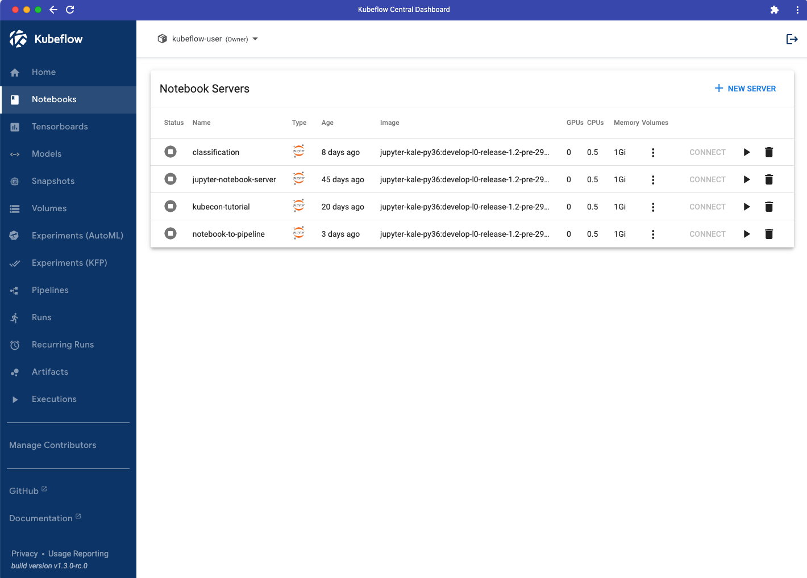
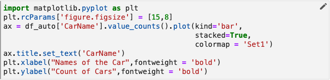
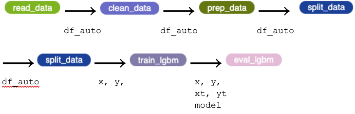
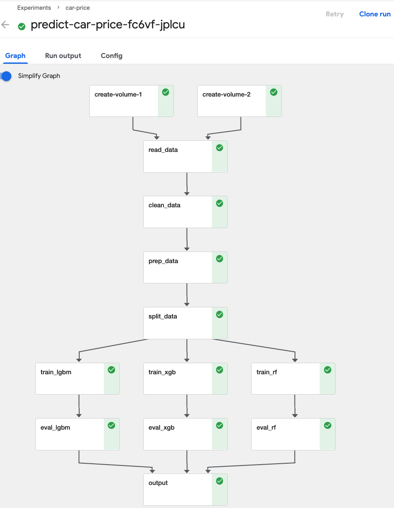
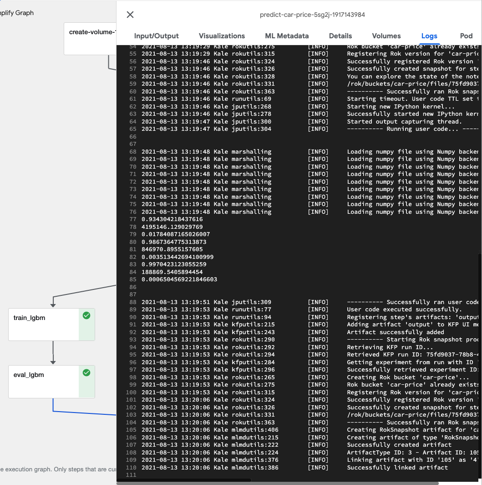
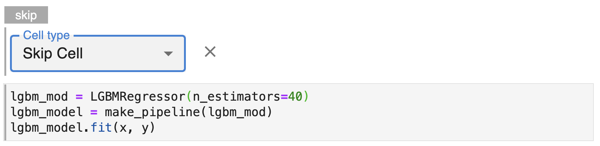

# **Arrikto 101**: Instructor Led Labs 

## Prepare MiniKF
To work with a notebook in Kubeflow we first need to launch a notebook server. To do this, follow the steps below.

### 1. View the Home screen in your MiniKF Kubeflow deployment.  

{: style="display: block; margin: auto; width:80%"}

### 2. Select the Notebooks pane from the main navigation menu.

{: style="display: block; margin: auto; width:80%"}

You will see the Notebook Servers dashboard. Unless you have already launched one or more notebook servers, your dashboard will be empty. 

{: style="display: block; margin: auto; width:80%"}

### 3. Click the *NEW SERVER* button.

{: style="display: block; margin: auto; width:80%"}

Once you have clicked NEW SERVER, a form will appear that will enable you to provide the settings for your notebook server.

{: style="display: block; margin: auto; width:80%"}

### 4. Enter a name.

In the Name field enter arrikto101-lab

{: style="display: block; margin: auto; width:80%"} 

### 5. Add a data volume.

Scroll down to the Data Volumes field. Add a data volume. The field values will auto-complete. You do not need to make any changes to the field values set for you.

{: style="display: block; margin: auto; width:80%"}

### 6. Click the *LAUNCH* button.

Scroll to the bottom of the form and click the *LAUNCH* button to create your notebook server.

{: style="display: block; margin: auto; width:80%"}

### 7. Connect to your notebook server.

To connect to the notebook server you’ve just created, click the *CONNECT* button in the Notebook Servers dashboard.

{: style="display: block; margin: auto; width:80%"}

Once you connect, you will see the Jupyter notebooks server user interface with an open file browser pane and launcher tab. 

## Environment Preparation
Now that you have a Notebook Server set up you need to download and add the relevant handout files to the Notebook Server. 

### 1. Download and Unzip the handout files
Download and unzip the [handout](handouts/arrikto101-handout.zip).

{: style="display: block; margin: auto; width:80%"}

`car_prices.csv` is your data file.

`data_dictionary-carprices.xlsx` provides some explanatory detail on your
dataset.

`predict_car_price.ipynb` is a notebook containing Python code that builds and
evaluates three models for predicting car prices based on your dataset. We will
modify the code in small ways and annotate this notebook to define and run a
Kubeflow pipeline!

`requirements.txt` lists the Python modules required for your notebook. We'll
use this file to install those requirements in a later step.

### 2. Open the arrikto101-lab folder

Double-click on the directory, `arrikto101-lab`.

{: style="display: block; margin: auto; width:80%"}

### 3. Click the file upload button

{: style="display: block; margin: auto; width:80%"}

### 4. Upload handout files

 In the file dialog that pops up, select the handout files you unzipped
 and upload them to your Jupyter notebook environment. You will see them appear in the `arrikto101-lab` directory.

{: style="display: block; margin: auto; width:80%"}

### 5. Create a new folder

Click the button to create a new folder.

{: style="display: block; margin: auto; width:80%"}

### 6. Name the folder "data"

{: style="display: block; margin: auto; width:80%"}

### 7. Move data files

Drag and drop `car_prices.csv` and `data_dictionary-carprices.xlsx` into the
data folder.

### 8. Open your notebook

Double-click `predict_car_price.ipynb` in the file browser pane.

{: style="display: block; margin: auto; width:80%"}

### 9. Enable Kale

Click the *Enable* toggle in the *Kale Deployment panel* to enable Kale.

{: style="display: block; margin: auto; width:80%"}

### 10. Launch a Terminal

Click the *Launcher* tab and launch a terminal.

{: style="display: block; margin: auto; width:80%"}

### 11. Install Requirements
In the new terminal enter

`cd arrikto101-lab-vol-1`

Now that you are in the right directory install the Python modules required by this notebook.

`pip install -r requirements.txt`

{: style="display: block; margin: auto; width:80%"}
### 12. Restart the Kernel

Return to the `predict_car_price.ipynb` notebook, restart the kernel.

{: style="display: block; margin: auto; width:80%"}

!!! important "Lab Approach"
    As you proceed from here with the lab you will be given both outcomes to work towards as well as steps on how to work towards these outcomes. Not all outcomes have steps, this is by design to help you build skills in this area. If you are unsure how to proceed please ask your instructor or refer to the presentation for supplemental information. 

## Creating Pipeline w/ Kale
Now that you are set up you will practice tagging cells with Kale to generate and automatically launch a pipeline in Kubeflow. You will first set up your initial pipeline steps - `prep_data` and `clean_data`.

### 1. Isolate the code for your step in one cell
Modify your code so that the line that reads the car_prices.csv file is in a
cell by itself. Once you are complete your cells should resemble the below:

{: style="display: block; margin: auto; width:80%"}

### 2. Annotate the cell as a *Pipeline Step* and name it

Click the pencil icon on that cell and set the *Cell type* to *Pipeline Step*
and the *Step name* to `read_data`.

{: style="display: block; margin: auto; width:80%"}

Click the x to close the annotation editor.

Note that in addition to the label, `read_data`, this cell of your pipeline is
now marked with a vertical line that is the same color as the background of
the label, `read_data`.

If you look more closely, you’ll see that, in fact, all cells below this first
cell have been marked with a vertical line of the same color.

{: style="display: block; margin: auto; width:80%"}

The default behavior for Kale is that it automatically includes the cells that
follow a step cell as part of the same step until you specify otherwise by
supplying annotations later in the notebook.

In its current state, your entire notebook after the cell in which we read the
`car_prices.csv` file is a single pipeline step. Obviously, we don’t want the
entire notebook to be a single-step pipeline, but this Kale behavior does
provide an important convenience as we’ll see in a moment.

Let’s define the second step of your pipeline. As we did before, we need to annotate
a cell with the *Pipeline Step* label. In situations like this where the step is
composed of multiple cells, you’ll want to ensure that all cells are annotated
accordingly.

### 3. Annotate the *Clean Data* step
Annotate the first cell of the data cleaning step and name this step `clean_data`.
The remaining cells for this step will be included in this annotation. If you can’t
remember exactly how to annotate a cell, see the example for `read_data` above or
review the Kale documentation.

When you have finished annotating `clean_data`, that portion of your notebook should
look like the following.

{: style="display: block; margin: auto; width:80%"}

In order to define a pipeline you need to identify not just the code that makes
up the step, but also specify the order in which the steps of your pipeline
should execute. To do this, select which step (or steps) should immediately
precede the step you are annotating by using the Depends on pull-down menu. The step `clean_data` relies on `read_data` to read your dataset into a `pandas`
data frame (`df_auto`) so we need to define that relationship and establish the
sequence in which these two steps should execute.

{: style="display: block; margin: auto; width:80%"}

### 4. Organize Pipeline Modelling Steps
Besides the first cell in the notebook, let’s review where else we have
imports in the cells leading up to the Modeling section. There are two
cells in the *Visualize Data* section that include imports. Scroll down to find them, they are as follows.

{: style="display: block; margin: auto; width:80%"}

{: style="display: block; margin: auto; width:80%"}

Move these imports so that they are together with the others in the
first cell of your notebook. Once you've done that, the first cell in your
notebook will look like this.

{: style="display: block; margin: auto; width:80%"}

The modified cells in the *Visualize Data* section should look like
this.

{: style="display: block; margin: auto; width:80%"}

{: style="display: block; margin: auto; width:80%"}

Now, let’s apply the Imports annotation to the cell containing your reorganized imports. Your Imports cell should look like this when completed.

{: style="display: block; margin: auto; width:80%"}

Now you need to do the same for the Modeling section of your notebook. Scroll to the Modeling section and make the following changes:

- Create a cell just below the _Modeling_ head. 
- Move all import statements from below this point in the notebook into the new cell. Note that there are imports in several places, make sure you collect them all. 
- Annotate the new cell you created as an **Import** cell. 

When you are done the cell should look like this.

{: style="display: block; margin: auto; width:80%"}

### 5. Skip Unnecessary `read_data` and `clean_data` Cells
In their current form, your `read_data` and `clean_data` steps both contain a 
number of lines of code that generate diagnostic output or do other work that
is not core to the work of those steps. For pipeline runs, we don’t want to
include this code, because it will add unnecessary compute cycles and
execution time.

{: style="display: block; margin: auto; width:80%"}

We can keep this code in your notebook where it will be of use as we continue
to develop your models, but explicitly exclude it from pipeline steps. To do
this, we need to make sure that all the statements to be excluded are in
separate cells from the code that is core to pipeline steps. Then, we can
apply the *Skip Cell* annotation to these cells.

For the `read_data` step, we’ll want to skip the calls to `df.auto.head()` and
`df.auto.describe()`. To do this, edit each cell and select *Skip Cell* from the
*Cell type* pull down menu. When you’ve done this successfully, your `read_data` step will look something
like the figure below.

{: style="display: block; margin: auto; width:80%"}

Update the cells in the *Clean Data* section of your notebook so that cells
not necessary for cleaning data will be excluded from the `clean_data` pipeline
step. This includes the cells that contain:

- ````df_auto.dtypes````
- ````df_auto.loc[df_auto.duplicated()]````
- ````df_auto.head()````

### 6. Skip Visualization Sections
The Visualize Data section of this notebook informs how we build models. We don’t need to run the cells in the *Visualize Data* section as part of your pipeline, though we should keep this section in the notebook because, as is the case with most projects of this nature, we will likely need to refine your models further and want to return to a visualization and analysis phase in a future iteration.

To keep the Visualize Data section in the notebook, but also have Kale ignore
it, we need to annotate all the cells in this section as *Skip Cells* just like
we did for the diagnostic cells in the two pipeline steps we’ve already
defined. Update your copy of your notebook so that all cells in the Visualize Data
section of your notebook will be excluded from the Kubeflow pipeline we are
building.

### 7. Organize `prep_data` Step
In the *Prep Data* section of your notebook, we are performing two operations:

- Selecting the significant independent variables (columns) that we will
   use as features for your regression models and only including these columns
   in your data frame.
- Encoding categorical variables so that they can be used by your models. 

To incorporate the *Prep Data* section as a step in your Kubeflow pipeline, modify your copy of your notebook to meet the following requirements:

- Create a new pipeline step.
- Set the step name to `prep_data`.
- Specify the correct *Depends On* as `clean_data`.
- Include all cells that contain code that is core to the step `prep_data`.

When you have completed the above your cell should look like this.

{: style="display: block; margin: auto; width:80%"}

Additionally you will need to exclude cells in the *Prep Data* section that are **not** core to the functionality of this step. These include:

- `df_auto.head()`
- `corr=df_auto.corr()
corr.style.background_gradient(cmap="inferno")`
- `plt.figure(figsize=(15,15))
sns.heatmap(df_auto.corr(), annot=True, cmap='inferno', 
            mask=np.triu(df_auto.corr(),k=1))`

### 8. Organize `split_data` Step

In the *Build Models* subsection of the *Modeling* section, we split data for
training and evaluation and then build and evaluate three regression models. In
this lab, we’ll define a pipeline step for the data splitting portion of your
workflow.

Annotate the cell in the *Build Models* section of your notebook and call it `split_data` and have it depend on `prep_data` step. When complete your cell should look like this. 

{: style="display: block; margin: auto; width:80%"}

### 9. Finish Designing Pipeline
To complete your pipeline we need to do a little code reorganization. We’ll be
training and evaluating three models simultaneously. It does not make sense to
combine the model training and evaluation code in a single cell or step, which is how the notebook is currently configured on the back of investigation. We can use the resources of a Kubernetes cluster more efficiently if we split
these phases into separate pipeline steps.

In addition, Kale provides a snapshotting feature that enables you to return to
the execution state of any step during a pipeline run. So, if you want to make
changes to an evaluation step, you can do so and then rerun the pipeline from
just after the training step completes. For long-running pipelines this can
save a lot of time. 

As an example of designing pipelines for iteration, we’ll demonstrate
reorganizing the code for the LGBM regression model into separate cells and
steps. 

{: style="display: block; margin: auto; width:80%"}

The code for the LGBM model is depicted in the figure above. In the notebook this is split into multiple cells for model training, diagnostic output,
and evaluation. We’ll leave the print statements together with the evaluation
code, because we want to output the result as part of the last step for these
branches of your pipeline.

{: style="display: block; margin: auto; width:80%"}

Next, we’ll annotate these cells to create two new pipeline steps, `train_lgbm`
and `eval_lgbm`. 

`split_data` is the step on which `train_lgbm` depends and `train_lgbm` is the
step on which `eval_lgbm` depends.

{: style="display: block; margin: auto; width:80%"}
Your pipeline can now be depicted as:

{: style="display: block; margin: auto; width:80%"}

### 10. Create `train_rf` and `eval_rf` steps

Following a process similar to what we did for the LGBM regression model in the
previous section, reorganize the code and apply the appropriate annotations for
the RandomForest (RF) model. For this lab, the code you will work with is found
in this cell.

{: style="display: block; margin: auto; width:80%"}

Reorganize and annotate the code for the RF model to meet the following
requirements:

- Create a new pipeline step called `train_rf` to train the RF model.
- Create a new pipeline step called `eval_rf` to evaluate the RF model.
- Specify the correct dependency relationships for both steps. **Note that
   the `train_rf` step begins a branch in your pipeline. This branch can run in
   parallel with the branch for the LGBM model.**
- For each step, include only cells that contain code that is core to the step.
- Exclude cells that are not core to one step or the other using the *Skip Cell*
   annotation.

When complete the `train_rf`, `eval_rf` and `skip` cells should look like this.

{: style="display: block; margin: auto; width:80%"}

Now do the same for the XGB model, when complete your cells should look like this.

{: style="display: block; margin: auto; width:80%"}

### 11. Run Your Pipeline

Now it’s time to run your pipeline. In the Kale Deployment panel, which you opened by selecting `Enable` 

- Click the pull-down menu for Select experiment and create a new experiment
called arrikto101-lab.
- Enter “arrikto-lab” as the pipeline name.
- Click the COMPILE AND RUN button.

{: style="display: block; margin: auto; width:80%"}

Once the pipeline is running, view the run by clicking the *View* link.

{: style="display: block; margin: auto; width:80%"}

This will open a panel to enable you to view the complete pipeline graph as the
pipeline executes.

Note that, as expected, training and evaluation for your models run in parallel.

{: style="display: block; margin: auto; width:80%"}

The steps in the pipeline are clickable and provide detailed information about
that step. Most of the detail view for a step is outside the scope of this
module, but let’s click on the output step and view the Logs tab.

{: style="display: block; margin: auto; width:80%"}

If we zoom in, we can see the output produced by the output step reporting on
the prediction performance of all three of your models.

{: style="display: block; margin: auto; width:80%"}

Feel free to explore other output tabs and other aspects of the pipeline run.

!!! important "If Pipeline Errors Out"
    The most likely cause of this, besides incorrect tagging, is not having installed the packages from the requirements.txt file. Please make sure that you revisit this step - `Environment Preparation - Install Requirements` if you error out here. 

## Hyperparameter Tuning w/ Katib
Now that you have confirmed that your Kale tagging is working and creating pipelines it is time to perform hyperparameter tuning. Typically you would look a the results of the `eval_model` steps to identify the ideal model to tune. For the sake of this lab we will focus on XGB. 

### 1. Imports Cell
Create a new cell directly below the first _Imports_ cell.

{: style="display: block; margin: auto; width:80%"}

Create three new hyperparameters with the respective default values.

````
NUM_ESTIMATORS = 500
MAX_DEPTH = 3
LEARNING_RATE = 0.01
````

Click the edit icon and tag the cell with `Pipeline Parameters`. 

{: style="display: block; margin: auto; width:80%"}

Scroll down to the cell where the xgb model is created and edit the cell to parametize the XGB model creation.

```
xgb1 = XGBRegressor()
parameters = {'n_estimators': [NUM_ESTIMATORS], 'max_depth': [MAX_DEPTH], 'learning_rate': [LEARNING_RATE]}
xgb_grid = GridSearchCV(xgb1,parameters,cv = 2)

xgb_grid.fit(x,y)
```

When completed your cell should look like this.

{: style="display: block; margin: auto; width:80%"}

In order to perform an experiment within Kale you will need to move at least one print(eval_metric) statements into the final cell of the notebook. You will also need to tag this cell with `Pipeline Metrics`. 

Create a new cell at the bottom of the Notebook and enter 

````
print(xgb_r2_score)
````

{: style="display: block; margin: auto; width:80%"}

Tag the cell with `pipeline-metrics` so Kale recognizes this cell when creating the Katib Job. When completed your cell should look like this.

{: style="display: block; margin: auto; width:80%"}

### 2. Skip Cells
You will need to omit all unnecessary steps from your pipeline given that at this point you know the model you want to work with. 

Within the _Build Models_ section scroll down to the `train_lgbm` cell. 
Edit this cell and change the Kale tag to `skip`.

{: style="display: block; margin: auto; width:80%"}

Still in the _Build Models_ section scroll down to the `eval_lgbm` cell. 
Edit this cell and change the Kale tag to `skip`.

{: style="display: block; margin: auto; width:80%"}

Perform the same for the `train_rf` and `eval_rf` cells. 

### 3. Set Up Katib Job 

The preparation done in advance ensures that when you go to configure a Katib Job all the options will be prepopulated or will be based on
what has been defined in the notebook cells. Toggle the `HP Tuning with Katib` option to set up the Katib Job.

{: style="display: block; margin: auto; width:80%"}

To configure the hyperparameter tuning job you will need to configure each of the following in the Set Up Katib Job UI.

- NUM_ESTIMATORS should start at 400 and go to 600 at intervals of 10.
- MAX_DEPTH should be between 1 and 5 at intervals of 1.
- LEARNING_RATE should be between 0 and 1 at intervals of 0.1.

Additionally:

- The Search Algorithm should be Grid Search.
- The Search Objective should be maximizing the value of r squared. 
You should do at last 3 trials, at most 12 and stop after 3 failed attempts. 

When completed your Katib Job should look like this.

{: style="display: block; margin: auto; width:80%"}

Once you have configured the job click `Compile and Run` to begin execution. 

### 4. Interpret Katib Output
Once execution has completed, which may take a while, you identify the ideal hyperparameters by reviewing the output from either the *Experiments (KFP)* UI. 

Navigate to the Experiments(AutoML) UI to confirm that the Katib Job is being executed. 

{: style="display: block; margin: auto; width:80%"}

Once the experiments have completed you will be able to select this entry to view the results. The UI will show a graph of attempted values and scrolling down will show the optimized values. Your output will look like this.

{: style="display: block; margin: auto; width:80%"}

## Snapshotting w/ Rok
Throughout your work Rok has been taking snapshots for you to rapidly restore Notebooks or individual steps in the Kubeflow pipeline. Now you will load one of these Snapshots into a new Notebook Server.

### 1. Open Snapshots
In the Kubeflow UI select `Snapshots` to view the Rok buckets that have been created.

{: style="display: block; margin: auto; width:80%"}

### 2. Open Bucket
Expanding the `arrikto101-lab` bucket will show the list of snapshots that have been taken during the lab. In the Snapshots UI select the bucket for the lab. 

{: style="display: block; margin: auto; width:80%"}

### 3. Copy URL for Snapshot
In the Kubeflow UI create a new Notebook Server and copy the URL from the top Rok Snapshot.

{: style="display: block; margin: auto; width:80%"}

### 4. Paste into Notebook Server
Create a new Notebook Server and name it `arrikto101-lab-rok`.

Paste the Rok URL into the `Rok URL` option. 

{: style="display: block; margin: auto; width:80%"}

You will see a notification on screen once the snapshot has been recognized.

{: style="display: block; margin: auto; width:80%"}

Once this is done select 'LAUNCH'

### 5. Open Notebook Server
Once the Notebook Server has been created open it to confirm that the Notebook is  loaded and available. 

## Congratulations!
You have successfully completed the Arrikto 101 Instructor Led Lab. Thank you for your attention and dedication to learning. If you have subsequent questions please find us on slack or reach out to alex.aidun@arrikto.com
