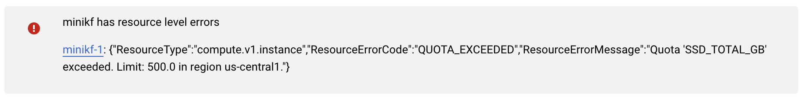

# MiniKF FAQ

We hope this FAQ helps you answer MiniKF questions, we realize we don't have all the answers because we do not yet
have all the questions! If you are in need of additional assistance please reach out to us on the ***MiniKF channel*** 
on the ***[Kubeflow Community](https://join.slack.com/t/kubeflow/shared_invite/zt-n73pfj05-l206djXlXk5qdQKs4o1Zkg)*** slack.

## Index
- [Frequently Asked Questions (FAQ)](#faq)  
- [Gathering MiniKF Logs](#minikf-logs)

## FAQ

### MiniKF Basics

**Question**: What is the difference between MiniKF and regular Kubeflow
installation on Kubernetes/Minikube?  
**Answer**: MiniKF is a packaged version of the whole stack that
installs automatically, so that you do not have to install Kubeflow manually. We
believe it is the easiest and fastest way to get up-and-running with Kubeflow.
MiniKF also includes Arrikto's Rok software for advanced data management, giving
you data versioning, reproducible pipelines, data protection for your notebooks,
and the foundation to share workloads along with data across K8s clusters.

**Question**: Do I need to start the VM to access MiniKF Kubeflow UI?  
**Answer**: Yes, the VM needs to be started and MiniKF needs to start up before the endpoint URL can be accessed.

**Question**: Do I need to run `minikf` in order to start MiniKF in the VM?  
**Answer**: No, you can SSH into the VM and execute `minikf` to see status but it will autostart.

**Question**: Does the login URL for the Kubeflow UI change each time VM is started?  
**Answer**: For GCP the URL will be static, for AWS it will change and it will be necessary 
to wait until the VM and MiniKF have started to see the new URL. 

**Question**: I’m thinking of upgrading but noticed number 5 in the
instructions says “Remove all local state. This will remove all of your
customization in MiniKF (notebooks, pipelines, Rok snapshots)“. Is this
necessary and if so, does this mean we need to manually export notebooks,
datasets, pipelines, etc if we want to preserve our work?  
**Answer**: Unfortunately, we don't support MiniKF upgrades
without losing the existing data. However, we do work with customers to provide
enterprise Kubeflow support and/or support for their MiniKF deployments. If this describes 
your situation please reach out to your account manager.

### MiniKF & Vagrant

**Question**: I am experiencing massive memory issues when running the Titanic
example on my laptop (MiniKF on Vagrant).  
**Answer**: The Titanic example requires higher memory than the
MiniKF VM on Vagrant has, you could upgrade your VM's RAM, but make sure that
the host has enough RAM to support this. The easiest way is to run the example
using MiniKF on GCP:
https://www.kubeflow.org/docs/started/workstation/minikf-gcp/

**Question**: I started MiniKF on a personal / private server and would like to share it on the
network. What's the proper way of doing it? I tried forwarding port with
Vagrant:
```
config.vm.network "forwarded_port", guest: 80, host: 8081    # MiniKF Terminal
config.vm.network "forwarded_port", guest: 8080, host: 8080  # KubeFlow
config.vm.network "forwarded_port", guest: 7681, host: 7681  # 
```
Although MiniKF Terminal is available, Kubeflow UI is not responding.   

**Answer**: Add in guest_ip: "10.10.10.10"  in the above lines
```
config.vm.network "forwarded_port", guest: 80, host: 8081     # MiniKF
config.vm.network "forwarded_port", guest: 8080, guest_ip: "10.10.10.10", host:
8080  # kubectl
config.vm.network "forwarded_port", guest: 7681, host: 7681   # 
```

**Question**: I cannot install MiniKF on my laptop.  
**Answer**: Your system must been the following requirements.
https://www.kubeflow.org/docs/other-guides/virtual-dev/getting-started-minikf/#system-requirements

**Question**: I have a MacBook that I believe meets the requirements, but I cannot
install MiniKF.  
**Answer**: While we test MiniKF on various MacBook models we can't test it exhaustively on all of them. 
With that said in general consider:
1. Monitoring your CPU utilization and check if your Macbook overheats when
   starting MiniKF.
2. Consider using a faster machine, if you have one available.
3. Try MiniKF on GCP.
   https://www.kubeflow.org/docs/started/workstation/minikf-gcp/

**Question**: Can I expose the MiniKF UI to be accessed from outside the host?  
**Answer**: You will need to forward the necessary ports to the
host, and possibly create some firewall rules.
See the relevant Vagrant docs:
https://www.vagrantup.com/docs/networking/forwarded_ports.html

**Question**: On my machine, I have 128G memory and 28 CPUs. By default, the
Minikube installation of the Vagrant Box uses 2 CPUs and 10G of memory. How can
I increase this to 8 CPUs and 32G of memory. I amended the VM specs from within
the VirtualBox UI.  
**Answer**: Although you can edit your VM from within the
VirtualBox UI, you shouldn't, because Vagrant will overwrite [at least some of]
your changes based on what is in the Vagrantfile. So, it's best to edit the
Vagrantfile and specify the CPU and  RAM you need. 

**Question**: During install Vagrant hangs at pod 33 / 34.  
**Answer**: This is likely due to a memory issue, make sure that the Vagrantfile is providing 24 GB (okay) - 32 (best) GB of Ram for 
Kubelow install.

**Question**: How do I access MiniKF behind a proxy?  
**Answer**: To access MiniKF behind a proxy you can use the
`vagrant-proxyconf` plugin and set `Vagrantfile` accordingly after `vagrant
init`. This [link](http://tmatilai.github.io/vagrant-proxyconf/) provides more
info regarding proxy configuration for Vagrant.

**Question**: I cannot install MiniKF. I get the following error message:  
```
VT-x is not available (VERR_VMX_NO_VMX)
```  
**Answer**: Hyper-V disables VT-x for other hypervisors, so VirtualBox cannot use it. Hyper-V disables VT-x for other hypervisors and VirtualBox says there is not VT-x available because when hyper-V is installed on Windows, the hypervisor is running all the time underneath the host OS. 
Only one process can control the VT hardware at a time for stability. The hypervisor blocks all other calls to the VT hardware. To
proceed, you need to disable Hyper-V: 
1. Open CMD as administrator. 
2. Turn off Hyper-V by running:  
   `bcdedit /set hypervisorlaunchtype off`. 
3. Reboot. 

To turn it back on:  
1. Run `bcdedit /set hypervisorlaunchtype`. 
2. Reboot. 


### MiniKF & GCP
**Question**: When I try to get MiniKF to run on GCP, I get resource level
errors.  
**Answer**: You cannot run MiniKF
(or Kubeflow in general) using the GCP Free Tier. See the official docs:
https://www.kubeflow.org/docs/gke/deploy/project-setup/
https://www.kubeflow.org/docs/started/workstation/minikf-gcp/

**Question**: When I try to get MiniKF to run on GCP, I get an QUOTA_EXCEEDED error.  

**Answer**: For default values, MiniKF requires 200G for boot disk and 500G for data disk. 
You will need to select a region with a greater quota limit. Please request a quota increase for your account if none are available. 


### MiniKF & Windows
**Question**: If i have to install Kubeflow on Windows should I install MiniKF
only or is there is something else I can install?  
**Answer**: Hi @username, you should only install MiniKF assuming you already
have Vagrant and VirtualBox on your windows machine. See the requirements here:
https://www.kubeflow.org/docs/other-guides/virtual-dev/getting-started-minikf/

### MiniKF & MacOS
**Question**: I’d like to try MiniKF on macos, but I don’t want to install
VirtualBox. How can I get it working with HyperKit or Docker?  
**Answer**: Hi @username, VirtualBox is a prerequisite for using MiniKF on your
laptop. As an alternative, you can use MiniKF on GCP:
https://www.kubeflow.org/docs/started/workstation/minikf-gcp/

### MiniKF & Notebooks
**Question**: When I do a PIP install, it says permission denied. When I open a
terminal through Jupyter notebook and run sudo pip install, it asks for a
password for the account jovyan. 
**Answer**: Please run this command from inside a Notebook Server:
```
pip3 install --user <lirary>
```

**Question**: A pipeline step fails with the following Rok-related error:
. 
**Answer**: Hi @username, it seems that you are out of space, you should delete
some workflows and/or PVCs. Let me know if this works.

## MiniKF Logs
Collecting MiniKF logs depends on where MiniKF is being used. 

### Vagrant
For Vagrant, in general, to collect and review logs you must:
1. `vagrant ssh` into your MiniKF VM
2. run `minikf-gather-logs`. This will produce a tarball `.tgz` file in your
   MiniKF directory.
3. Open the tarball file to see logs.
4. When necessary and instructed share the tarball file with Arrikto experts. 

### GCP
For GCP, in general, to collect and review logs you must:
1. [SSH from the Browser window](https://cloud.google.com/compute/docs/ssh-in-browser)
2. run `minikf-gather-logs`. This will produce a tarball `.tar.bz2` file under
   `/vagrant/`.
3. Download the file as described in [this guide](https://cloud.google.com/compute/docs/instances/transfer-files#transferbrowser).
   The exact path to download the logs file is `/vagrant/minikf-logs-<date>-<time>.tar.bz2`.
4. Open the tarball file to see logs.
5. When necessary and instructed share the tarball file with Arrikto experts. 
