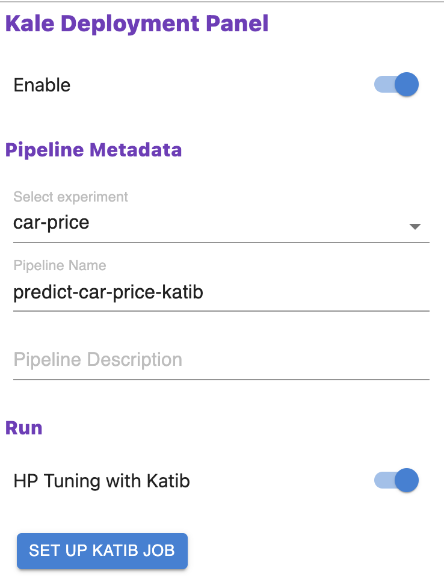
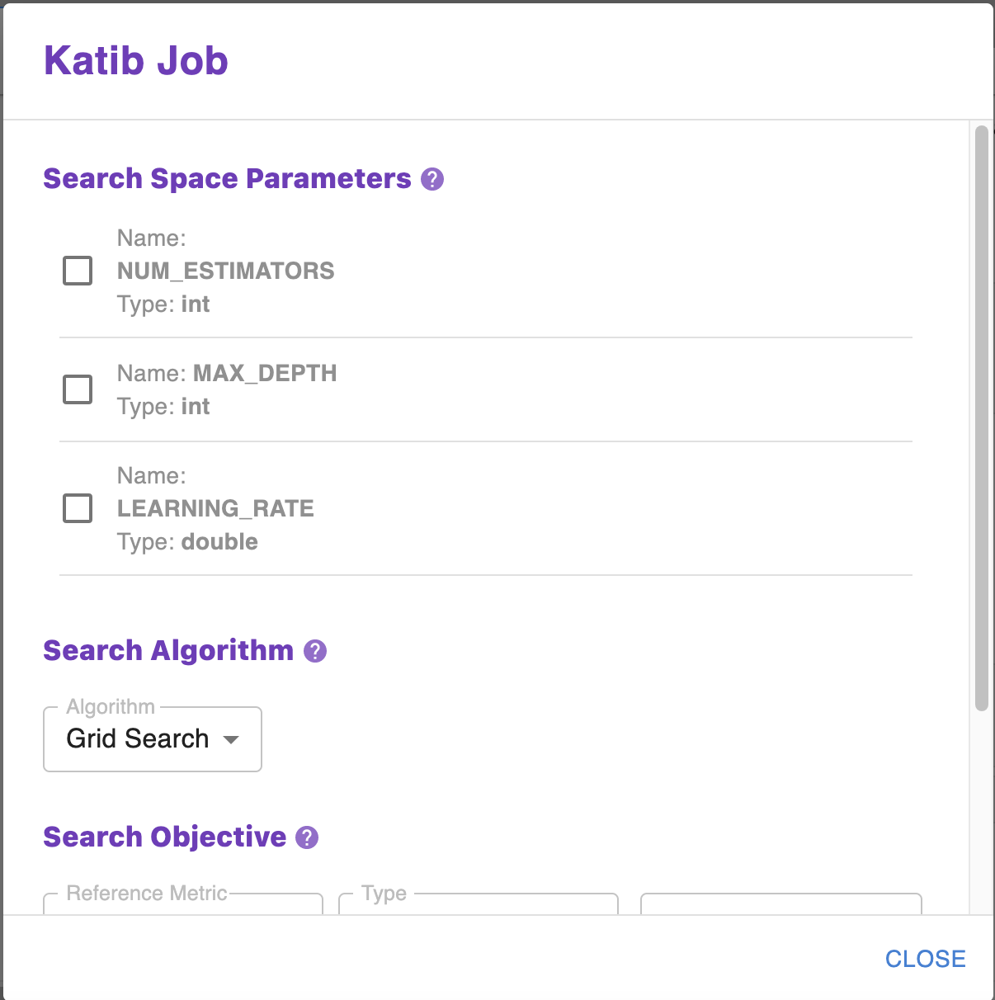

# Katib Job

<iframe src="https://player.vimeo.com/video/624531396?h=e9f77b3f31&amp;badge=0&amp;autopause=0&amp;player_id=0&amp;app_id=58479" frameborder="0" allow="autoplay; fullscreen; picture-in-picture" allowfullscreen style="position:absolute;top:0;left:0;width:100%;height:100%;" title="katib101katibjob.mov"></iframe>

Hyperparameter tuning attempts to optimize the set of hyperparameters for the defined pipeline metric. 
You will repeatedly run experiment trials while observing the impact to the pipeline metric to 
identify the ideal trial and as such ideal model. When configuring a Katib Job there are several parameters
that you will need to set. 

## Enable Katib 

!!! important "Follow Along"
    Please follow along in your own Notebook for the subsequent steps.
    
### 1. Toggle Enable Katib
Toggle *Enable Katib* from the Kale UI.

{: style="display: block; margin: auto; width:80%"}

### 2. Set Up Katib Job
Click *Set Up Katib Job* to see the Katib Job configuration.

{: style="display: block; margin: auto; width:80%"}

Before proceeding we will pause to review the Katib Job configuration options.

## Search Space Parameters
The Search Space Parameters are the set of all possible hyperparameter values that the Katib trials will adjust while attempting 
to optimize the Search Objective. Note that Katib will automatically pick up the Search Space Parameters from the cell tagged 
`Pipeline Parameters`. For each hyperparameter, you may provide a minimum and maximum value or a list of allowable values. 
Katib will test different values for the Search Space Parameters using this range or list of values during experimentation to 
optimize for the best model. 

## Search Algorithm
The Search Algorithm is the technique Katib will use to optimize the hyperparameter values for the desired optimization of 
the Search Objective. Katib in MiniKF or EKF offers several Search Algorithms for you to select from based on your need. For a detailed review of the available options please read our documentation. 

## Search Objective
The Search Objective is the metric you want the hyperparameter tuning to optimize. 
Note that this is picked up from the `Pipeline Metrics` cell tagged via Kale. 
You also specify whether you want the hyperparameter tuning job to maximize or minimize the metric. 
The default way to calculate the experiment’s objective is:

- When the objective type is maximize, Katib compares all maximum metric values.
- When the objective type is minimize, Katib compares all minimum metric values.

## Run Parameters
The Run Parameters put boundaries on the trials and Katib will run the experiment until the corresponding successful trials reach maxTrialCount. 

- parallelTrialCount: The maximum number of hyperparameter sets that Katib should train in parallel. The default value is 3.
- maxTrialCount: The maximum number of trials to run. This is equivalent to the number of hyperparameter sets that Katib 
should generate to test the model. If the maxTrialCount value is omitted, your experiment will be running until the objective goal 
is reached or the experiment reaches a maximum number of failed trials.
- maxFailedTrialCount: The maximum number of failed trials before Katib should stop the experiment. 
This is equivalent to the number of failed hyperparameter sets that Katib should test. If the number of failed trials exceeds 
maxFailedTrialCount, Katib stops the experiment with a status of Failed.

## Advanced Settings
In addition to standard set up the `Advanced Settings` allows you to configure a few additional parameters.
 
- You may select the docker image. 
- You may enable debugability. 
- You may elect to use the volumes directly attached to the Notebook.
- You may elect to have Rok take snapshots during each step. 

