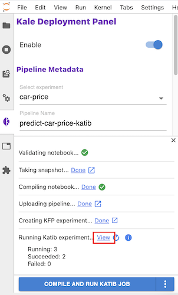
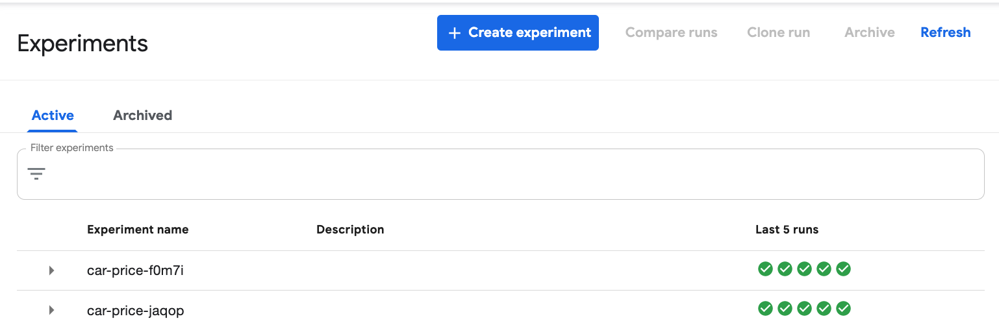
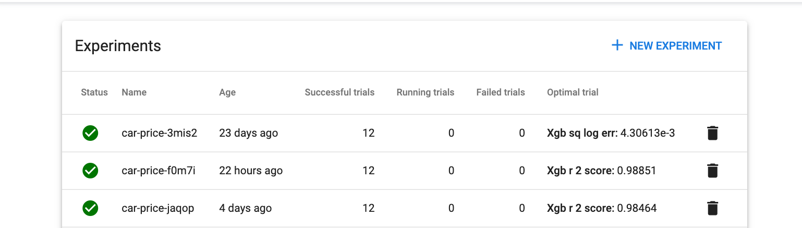

# Katib Output

<iframe src="https://player.vimeo.com/video/624588829?h=7df52c8f6d&amp;badge=0&amp;autopause=0&amp;player_id=0&amp;app_id=58479" frameborder="0" allow="autoplay; fullscreen; picture-in-picture" allowfullscreen style="position:absolute;top:0;left:0;width:100%;height:100%;" title="katib101reviewoutput"></iframe>

## Katib Execution
During execution Katib will run an experiment to identify the best hyperparameter values as per the objective 
and associated function (maximize or minimize) specified when setting up the Katib job. The output of each of this experiment 
as well as the performance details and the overall best run are all available via the Kubeflow UI. Since Katib is being facilitated by 
Kale you can confirm the pipeline created by clicking VIEW.

{: style="display: block; margin: auto; width:80%"}

## Experiments (KFP)
The Experiments (KFP) page shows the experiments that have been run in KubeFlow pipelines with the names based on the Kale and 
Katib inputs from the JupyterLabs Notebook. Selecting an individual experiment will provide a list of the individual runs that 
comprise the experiments, keeping in mind that this number is limited based on values provided in the Run Parameters section. 
The page also displays at the end of each run the value achieved for the Search Objective. 

{: style="display: block; margin: auto; width:80%"}

## Experiments (AutoML)
The Experiments (AutoML) page shows the list of experiments will showcase great detail about the trial runs and the associated 
hyperparameters that Katib is attempting to optimize. In addition to the number of runs and the breakdown of successful and failed 
runs the page also shows the achieved value of the optimal Search Objective. Selecting an individual run provides greater detail about 
the experiment and will also show the optimized hyperparameters.

{: style="display: block; margin: auto; width:80%"}

## Ideal Model
The ideal model hyperparameters based on the Katib tuning using the prescribed Search Algorithm and the associated Search Metrics are 
available through either Experiments UI. As a good practice we recommend taking the optimized hyperparameters and using them in the 
production models that you will serve based on the pipelines that are built with Kale & Katib. 
