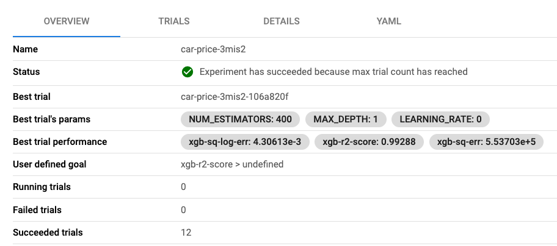

# Lab: Interpret Katib Output
There are two ways to identify the ideal hyperparameters for model optimization. 

## Requirement
Identify the ideal hyperparameters by reviewing the output from either the *Experiments (KFP)* UI or the *Experiments (AutoML)* UI.  

## Hint

??? hint "View Hint"
    - In the Experiments (KFP) UI you need to select the experiment set and review the column for the desired objective. 
    - In the Experiments (AutoML) UI you can either
        - Scroll down to the summary section.
        - Navigate to the *Trials* tab and view the highlighted trial. 

## Solutions

??? success "View Solution"
    For *Experiments(KFP)* Select the experiment with the best objective metric score, click the Config Tab, scroll down to the Parameters. 
    
    {: style="display: block; margin: auto; width:80%"}
    
    For *Experiments(KFP)* Scroll down to the Parameters: 
    
    {: style="display: block; margin: auto; width:80%"}

    To see which trial produced the best result select _Trials_ and 
    identify the highlighted row:
    
    {: style="display: block; margin: auto; width:80%"}

