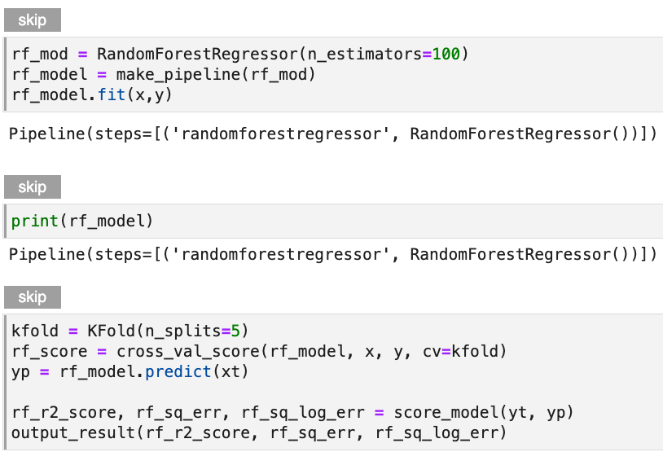

# Lab: Hyperparameter Tuning Preparation
Preparing your notebook for hyperparameter tuning involves:

1. Moving all relevant tracking metrics to the final cell of a notebook and 
tagging this cell with `Pipeline Metrics`.
2. Skipping all unnecessary cells so you only focus on the relevant model. 

In the prior walk through you began this exercise and now in this lab
you will finish the work you began. 

## Requirement
This lab has two requirements. First you must finish preparing the 
`Pipeline Metrics` cell. To do this you must:

1. Add `print(xgb_sq_err)` to the final cell
2. Add `print(xgb_sq_log_err)` to the final cell 
3. Tag the cell with `Pipeline Metrics`

Second you must finish skipping unnecessary cells. To do this 
tag the Random Forest model cells with `Skip`. 

## Solution

??? success "View Solution"
    
    The final cell in the notebook should look like this:
    
    {: style="display: block; margin: auto; width:80%"}
    
    The skipped cells should look like this:
    
    {: style="display: block; margin: auto; width:80%"}

Once you have completed this lab please proceed to the next page. 