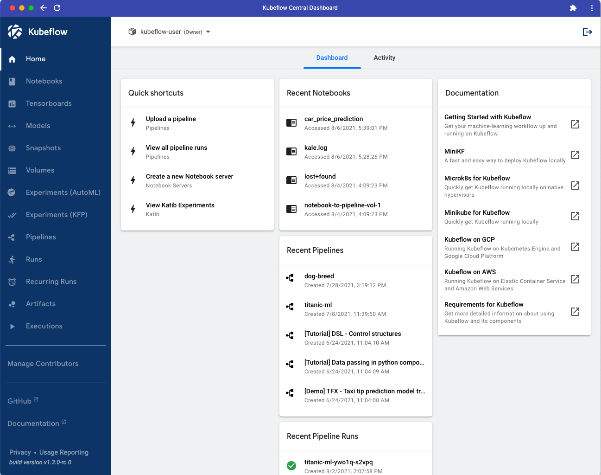

# Launch a Notebook Server from a Base Image

To work with a notebook in Kubeflow we first need to launch a notebook server. To do this, follow the steps below.

#### 1. View the Home screen in your MiniKF Kubeflow deployment.  

{: style="display: block; margin: auto; width:80%"}

#### 2. Select the Notebooks pane from the main navigation menu.

{: style="display: block; margin: auto; width:80%"}

You will see the Notebook Servers dashboard. Unless you have already launched one or more notebook servers, your dashboard will be empty. 

{: style="display: block; margin: auto; width:80%"}

#### 3. Click the *NEW SERVER* button.

{: style="display: block; margin: auto; width:80%"}

Once you have clicked NEW SERVER, a form will appear that will enable you to provide the settings for your notebook server.

{: style="display: block; margin: auto; width:80%"}

#### 4. Enter a name.

In the Name field, enter a name, e.g., learn-katib-pipelines.

{: style="display: block; margin: auto; width:80%"}

#### 5. Add a data volume.

Scroll down to the Data Volumes field. Add a data volume. The field values will auto-complete. You do not need to make any changes to the field values set for you.

{: style="display: block; margin: auto; width:80%"}

#### 6. Click the *LAUNCH* button.

Scroll to the bottom of the form and click the *LAUNCH* button to create your notebook server.

{: style="display: block; margin: auto; width:80%"}

#### 7. Connect to your notebook server.

To connect to the notebook server you’ve just created, click the *CONNECT* button in the Notebook Servers dashboard.

{: style="display: block; margin: auto; width:80%"}

Once you connect, you will see the Jupyter notebooks server user interface with an open file browser pane and launcher tab. 
