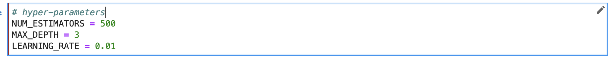
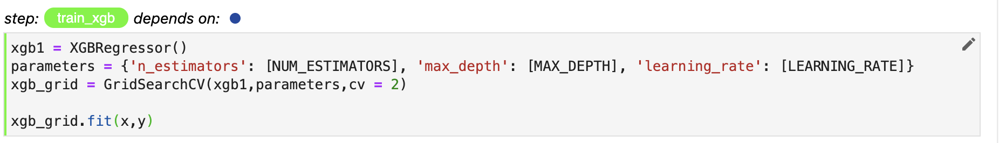
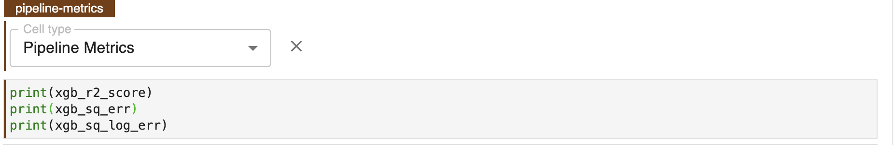

# Preparing for Hyperparameter Tuning - Hyperparameters & Objectives
Once you have identified your ideal model for hyperparameter tuning you will need to prepare the set of hyperparameters that 
you would like to tune. You will also need to identify one or more objetive metrics, referred to as PIPELINE METRICS for the 
purpose of optmiziation. Lastly you will want to remove any cells from unused models from processing to be efficient with resources.  

To perform hyperparameter tuning all parameters must first be introduced as variables and not hardcoded. Secondly for Kale and Katib to 
consider the hyperparameters for tuning they must be in their own cell and tagged accordingly. 

!!! important "Follow Along"
    Please follow along in your own copy of our notebook as we complete the steps below.

### 1. Create Hyperparamter Cell
Create a new cell directly below IMPORTS and create three new hyperparameters with the respective default values.

{: style="display: block; margin: auto; width:80%"}

Click the edit icon and tag the cell with PIPELINE PARAMETERS. 

![hyperparam-cell-tagged(images/hyperparam-cell-tagged.png)

### 2. Parametize XGB Model 
Scroll down to the cell where the xgb model is created and edit the cell as per the image below to include
the new parameters in the model creation definition. 

{: style="display: block; margin: auto; width:80%"}

## 3. Set Pipeline Metrics for Optimization 
In order to perform an experiment within Kale you will need to move the `print(eval_metric)` statements 
into the final cell of the notebook and tag with PIPELINE METRICS.

{: style="display: block; margin: auto; width:80%"}

Then when defining the hyperparameter tuning job you will have the option to select any of these metrics. 

## 4. Skip Uncessary Cells
You should omit all unnecessary steps from your pipeline given that at this point you know the model you want to work with.
Skipping these cells will reduce the size of the KubeFlow Pipeline that is created for experimentation and 
subsequently speed up the HyperParameter Tuning process. Before proceeding go through the notebook and tag the cells specific to 
the unused models (lgbm and rf) as SKIP. 
