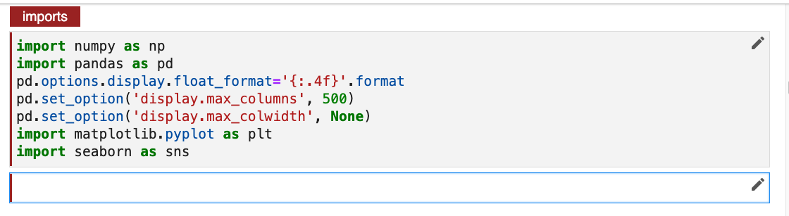
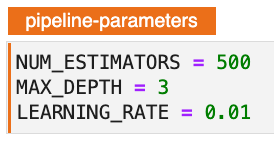

# Preparing for Hyperparameter Tuning - Hyperparameters & Objectives
Once you have identified the best performing model you will need to identify the set of hyperparameters that 
you would like to tune. You will also need to identify an objective metric to use as the basis for evaluating the relative performance of different hyperparameter settings. Lastly, you will want to exclude models we are no longer considering from the pipeline by skipping all cells for those models.

To perform hyperparameter tuning all parameters must first be introduced as variables and not as static inputs as parameters in the model function call. Secondly for Kale and Katib to consider the hyperparameters for tuning they must be in their own cell and tagged accordingly. 

!!! important "Follow Along"
    Please follow along in your own copy of our notebook as we complete the steps below.

### 1. Create Hyperparamter Cell
Create a new cell directly below the first _Imports_ cell.

Create three new hyperparameters with the respective default values.

{: style="display: block; margin: auto; width:80%"}

Click the edit icon and tag the cell with _Pipeline Parameters_. 

### 2. Parametize XGB Model 
Scroll down to the cell where the xgb model is created and edit the cell as per the image below to include the new parameters in the model creation definition. 

{: style="display: block; margin: auto; width:80%"}

## 3. Set Pipeline Metrics for Optimization 
In order to perform an experiment within Kale you will need to add `print(eval_metric)` statements into the final cell of the notebook. You will also need to tag this cell
with _Pipeline Metrics_. 

Create a new cell at the bottom of the Notebook and enter `print(xgb_r2_score)`. 

{: style="display: block; margin: auto; width:80%"}

You will complete this cell as part of the next lab.

## 4. Skip Unnecessary Cells
You will need to omit all unnecessary steps from your pipeline given that at this point you know the model you want to work with. Skipping these cells will reduce the size of the KubeFlow pipeline that is created for experimentation and subsequently speed up the hyperparameter tuning process. 

Within the _Build Models_ section scroll down to the `train_lgbm` cell. 
Edit this cell and change the Kale tag to `skip`.

{: style="display: block; margin: auto; width:80%"}

Still in the _Build Models_ section scroll down to the `eval_lgbm` cell. 
Edit this cell and change the Kale tag to `skip`.

{: style="display: block; margin: auto; width:80%"}

You will complete skipping cells are part of the next lab. 
