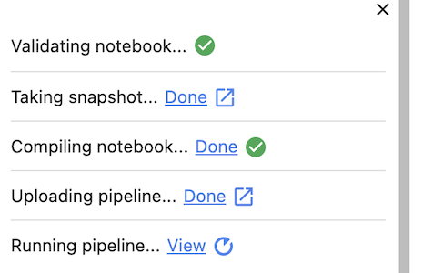
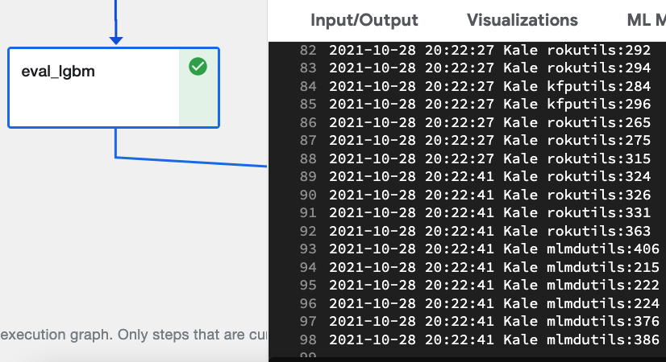

# Prepare for HyperParameter Tuning - Ideal Model

<iframe src="https://player.vimeo.com/video/624531626?h=a70000a8c5&amp;badge=0&amp;autopause=0&amp;player_id=0&amp;app_id=58479" frameborder="0" allow="autoplay; fullscreen; picture-in-picture" allowfullscreen style="position:absolute;top:0;left:0;width:100%;height:100%;" title="katib101prepare.mov"></iframe>

Before you can perform hyperparameter tuning you must select the model  you wish to tune. 
To do this typically data scientists will run several models and evaluate quality metrics on the models.
Once the ideal model has been selected you are ready to proceed to hyperparameter tuning. 

## Identify Model for Tuning
The ideal model for tuning is typically the model with the highest training accuracy per the quality metrics. 
As a first step you need to run the Jupyter Notebook with Kale enabled to generate model test results.
Before running your model make sure that you are outputting model measurements.

!!! important "Follow Along"
    Please follow along in your own copy of our notebook as we complete the steps below.

### 1. Confirm Outfrom from Eval Steps
Notice that the eval_* steps contain code to print out model quality measurements. 

{: style="display: block; margin: auto; width:80%"}

Each cell that performs evaluation should have a similar line of code. 

!!! note "Kale 101 Notebook Users" 
    If you are reusing your Kale 101 notebook you will need to move the respective lines of code from the last cell
    into each of the eval blocks. Go ahead and do that now before proceeding. 

### 2. Compile and Run Notebook w/ Kale
Select *Complie and Run* to test the models using Kubeflow Pipelines.

{: style="display: block; margin: auto; width:80%"}

Confirm successful execution by viewing the output from Kale.

{: style="display: block; margin: auto; width:80%"}

### 3. Access Kubeflow Pipeline
Click *View* next to *Running Pipelines* to access the relevant Kubeflow Pipelines logs for analysis.

{: style="display: block; margin: auto; width:80%"}

Once in the pipeline display scroll down to observe three steps pipelines, executed in parallel, for the three models. 

{: style="display: block; margin: auto; width:80%"}

### 4. Review A Model
Click *eval_lgbm* and then click *logs* to see the quality metric output. 

{: style="display: block; margin: auto; width:80%"}

Scroll until you see the three numbers coupled together, these are the output from the eval_step for each model. 

{: style="display: block; margin: auto; width:80%"}

Recall that the metrics are presented as follows

- r squared
- mean squared error
- mean squared logarithmic error

Take note of these three numbers, you will need them to compare against the other models in the subsequent lab. 
