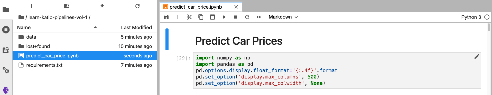

# Get Dataset and Code

To work through this module you will need the code and data we have provided. 
This module will build on the notebook created in Kale 101. 
If you are not familiar with Kale we strongly recommend you complete Kale 101.
If you do not have the completed notebook available you may download and unzip the [handout](handouts/learn_katib_pipelines_handouts.zip). 

## Upload the handout files

Once you’ve unzipped the handout, you should see the following files.

#### 1. Review the handout files

{: style="display: block; margin: auto; width:80%"}

`car_prices.csv` is our data file.

`data_dictionary-carprices.xlsx` contains examples images for the notebook and will need to be treated as a separate folder.

`dogImages` provides some explanatory detail on our dataset.

`predict_car_price_katib.ipynb` is a notebook containing Python code that builds and evaluates three models 
for predicting car prices based on our dataset. We will build on the modified and annoted code from Kale 101 
to define and run Katib Experiments in Kubeflow Pipelines! 

#### 2. Open the learn-katib-pipelines-vol-1 folder

Double-click on the directory, `learn-katib-pipelines-vol-1`.

{: style="display: block; margin: auto; width:80%"}

#### 3. Click the file upload button

{: style="display: block; margin: auto; width:80%"}

#### 4. Upload handout files

 In the file dialog that pops up, select the three handout files you unzipped
 and upload them to your Jupyter notebook environment.

{: style="display: block; margin: auto; width:80%"}

You will see them appear in the `learn-katib-pipelines-vol-1` directory.

{: style="display: block; margin: auto; width:80%"}

#### 5. Create a new folder

Click the button to create a new folder.

{: style="display: block; margin: auto; width:80%"}

#### 6. Name the folder "data"

{: style="display: block; margin: auto; width:80%"}

#### 7. Move data files

Drag and drop `car_prices.csv` and `data_dictionary-carprices.xlsx` into the
data folder.

{: style="display: block; margin: auto; width:80%"}

#### 8. Open our notebook

Double-click `predict_car_price_katib.ipynb` in the file browser pane.

{: style="display: block; margin: auto; width:80%"}

#### 9. Enable Kale

Click the *Enable* toggle in the *Kale Deployment panel* to enable Kale.

{: style="display: block; margin: auto; width:80%"}
