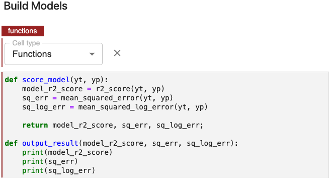
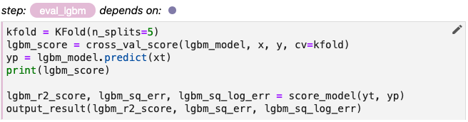
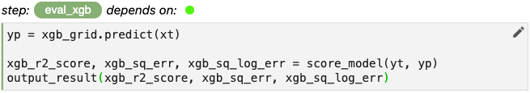

# Create a Functions Cell

!!! important "Follow Along"
    Please follow along and make the corresponding changes in your own copy of our notebook.

Let’s get some experience with Functions cells by abstracting out the scoring and output
functionality from our evaluation steps. The last several lines for each of our evaluation
steps are nearly identical. 

{: style="display: block; margin: auto; width:80%"}

{: style="display: block; margin: auto; width:80%"}

{: style="display: block; margin: auto; width:80%"}

Let’s write two functions to handle this logic and place them in a cell we’ll annotate
using the *Functions* label.

We’ll place this cell at the very top of the *Build Models* subsection

{: style="display: block; margin: auto; width:80%"}

Then let's modify each of our evaluation steps accordingly.

{: style="display: block; margin: auto; width:80%"}

{: style="display: block; margin: auto; width:80%"}

{: style="display: block; margin: auto; width:80%"}

This simple example illustrates the purpose of *Functions* cells and how to create and
annotate them. In later modules, we’ll make greater use of *Functions* cells.
