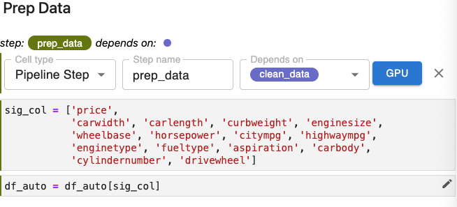

# Solution - Lab: Create `prep_data` Step

## Requirements

To incorporate the *Prep Data* section as a step in our Kubeflow pipeline,
please modify your copy of our notebook to meet the following requirements:

1. Create a new pipeline step.
2. Set the step name to `prep_data`.
3. Specify the correct step on which `prep_data` depends as the *Depends on*
   parameter.
4. As part of this annotation, include only cells that contain code that is
   core to this step.
5. Exclude cells in the *Prep Data* section that are not core to the
   functionality of this step using the *Skip Cell* annotation.

## Solution

Requirements 1, 2, 3, and 4: 

- Apply the *Pipeline Step* annotation to the first cell in the 
*Prep Data* section to create a new pipeline step.
- Specify `prep_data` as the value for the Step name parameter.
- Specify `clean_data` as the step on which `prep_data` depends.
We use `clean_data` here rather than `read_data` because we want the data in 
the `df_auto` data frame after it has been cleaned up by the operations in the
`clean_data` step.
- These cells select just the significant columns we identified
during data analysis. It is only these that we want to use in training our
model, so these two cells are essential to the prep_data step.

{: style="display: block; margin: auto; width:80%"}

Our pipeline can now be depicted as:

{: style="display: block; margin: auto; width:80%"}

Requirement 5: This cell simply produces some diagnostic output used when we
were developing this notebook to ensure that the data frame was being modified
to include only the significant columns. We annotate it as a skip cell.

{: style="display: block; margin: auto; width:80%"}

Requirement 4: This cell transforms the categorical variables in our data set
so that they can be used in training our model. It is essential to the
`prep_data` step.

{: style="display: block; margin: auto; width:80%"}

Requirement 5: This cell produces diagnostic output. We annotate it as a skip
cell.

{: style="display: block; margin: auto; width:80%"}

