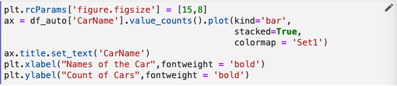

# Apply the Imports Annotation

We’ll do a bit more reorganization in the Modeling section later in this
module, so for now, let’s just focus on the portion of our notebook up to
the Modeling section.

!!! important "Follow Along"
    Please follow along in your own copy of our notebook as we address these 
    imports.

Besides the first cell in the notebook, let’s review where else we have
imports in the cells leading up to the Modeling section. There are two
cells in the *Visualize Data* section that include imports. They are as
follows.

{: style="display: block; margin: auto; width:80%"}

{: style="display: block; margin: auto; width:80%"}

Let's move these imports so that they are together with the others in the
first cell of our notebook. Noce we've done that, the first cell in our
notebook will look something like this.

{: style="display: block; margin: auto; width:80%"}

The modified cells in the *Visualize Data* section should look something like
this.

{: style="display: block; margin: auto; width:80%"}

{: style="display: block; margin: auto; width:80%"}

Now, let’s apply the Imports annotation to the cell containing our reorganized imports.

{: style="display: block; margin: auto; width:80%"}
