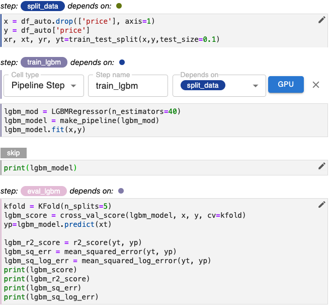

# Example

As an example of designing pipelines for iteration, we’ll demonstrate
reorganizing the code for the LGBM regression model into separate cells and
steps. 

!!! important "Follow Along"
    Please follow along and make the corresponding changes in your own copy of
    our notebook.

{: style="display: block; margin: auto; width:80%"}

The code for the LGBM model is depicted in the figure above. As a first step,
let’s split this cell into multiple cells for model training, diagnostic output,
and evaluation. We’ll leave the print statements together with the evaluation
code, because we want to output the result as part of the last step for these
branches of our pipeline.

{: style="display: block; margin: auto; width:80%"}

Next, we’ll annotate these cells to create two new pipeline steps, `train_lgbm`
and `eval_lgbm`. 

`split_data` is the step on which `train_lgbm` depends and `train_lgbm` is the
step on which `eval_lgbm` depends.

{: style="display: block; margin: auto; width:80%"}

Our pipeline can now be depicted as:

{: style="display: block; margin: auto; width:80%"}