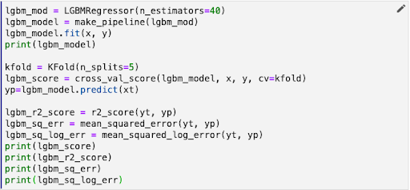

# Design for Iteration

To complete our pipeline we need to do a little code reorganization. We’ll be
training and evaluating three models simultaneously. It doesn’t make sense to
combine the model training and evaluation code in a single cell or step as we
have it in the example depicted below. 

{: style="display: block; margin: auto; width:80%"}

We can use the resources of a Kubernetes cluster more efficiently if we split
these phases into separate pipeline steps.

In addition, Kale provides a snapshotting feature that enables you to return to
the execution state of any step during a pipeline run. So, if you want to make
changes to an evaluation step, you can do so and then rerun the pipeline from
just after the training step completes. For long-running pipelines this can
save a lot of time. 

!!! important
    Break your pipeline down to separate all discrete steps you might want to
    iterate on independently from other components of your workflow. 