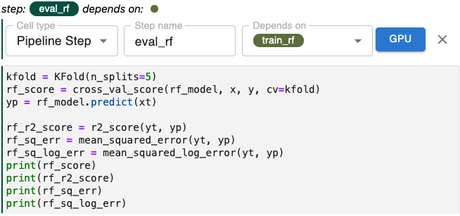

# Solution - Lab: RF train and eval steps

Following a process similar to what we did for the LGBM regression model in the
previous section, reorganize the code and apply the appropriate annotations for
the RandomForest (RF) model. For this lab, the code you will work with is found
in this cell.

{: style="display: block; margin: auto; width:80%"}

## Requirements 

Reorganize and annotate the code for the RF model to meet the following
requirements:

1. Create a new pipeline step called `train_rf` to train the RF model.
2. Create a new pipeline step called `eval_rf` to evaluate the RF model.
3. Specify the correct dependency relationships for both steps. **Note that
   the `train_rf` step begins a branch in our pipeline. This branch can run in
   parallel with the branch for the LGBM model.**
5. For each step, include only cells that contain code that is core to the
   step.
6. Exclude cells that are not core to one step or the other using the
   *Skip Cell* annotation.

## Solution

**Requirements 1, 4**: Following the example for the LGBM model, we need to
isolate the code that creates and trains the RandomForest model in a single
cell. Requirements 1 and 4 are addressed in the code depicted in this figure.

{: style="display: block; margin: auto; width:80%"}

**Requirement 3**: Like, `train_lgbm`, this step has `split_data` as a
dependency. This creates a branch in our pipeline. 

{: style="display: block; margin: auto; width:80%"}

**Requirement 5**: This cell just prints a diagnostic message. We can skip it
in pipeline execution.

{: style="display: block; margin: auto; width:80%"}

**Requirements 2, 4**: The code for the `eval_rf` step is depicted in the
figure below. We’ll leave the print statements together with the evaluation
code, because we want to output the result as part of the last step for this
branch of our pipeline.

{: style="display: block; margin: auto; width:80%"}

**Requirement 3**: This step depends on `train_rf` (uses the value of
`rf_model`) and indirectly on `split_data` because it uses the data values
referenced by the variables: `x`, `y`, `xt`, and `yt`.

