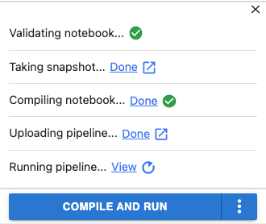
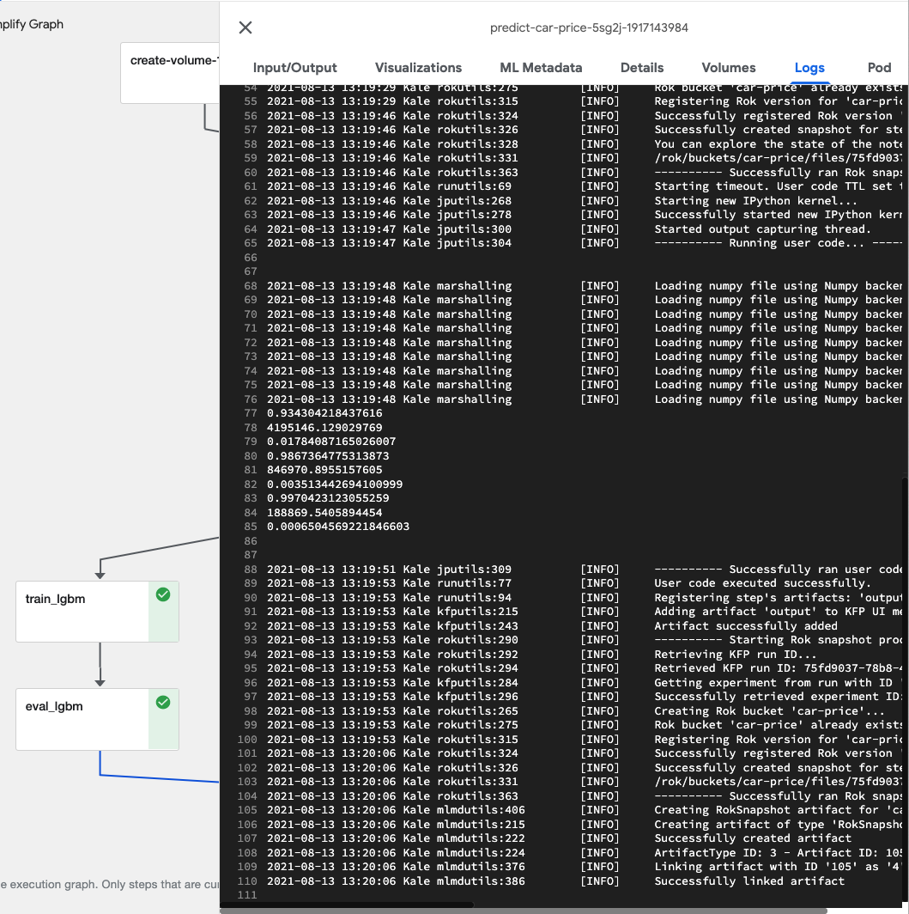

# Run Our Pipeline

Now it’s time to run our pipeline. To do this:

1. Open the Kale Deployment panel, by clicking on the Kale icon in your Jupyter
notebook environment.
2. Click the pull-down menu for Select experiment and create a new experiment
called car-price.
3. Enter “predict-car-price” as the pipeline name.
4. Click the COMPILE AND RUN button.

{: style="display: block; margin: auto; width:80%"}

Once the pipeline is running, view the run by clicking the *View* link.

{: style="display: block; margin: auto; width:80%"}

This will open a panel to enable you to view the complete pipeline graph as the
pipeline executes.

Note that, as expected, training and evaluation for our models run in parallel.

{: style="display: block; margin: auto; width:80%"}

The steps in the pipeline are clickable and provide detailed information about
that step. Most of the detail view for a step is outside the scope of this
module, but let’s click on the output step and view the Logs tab.

{: style="display: block; margin: auto; width:80%"}

If we zoom in, we can see the output produced by the output step reporting on
the prediction performance of all three of our models.

{: style="display: block; margin: auto; width:80%"}

Feel free to explore other output tabs and other aspects of the pipeline run.
We’ll address everything you see here in upcoming training modules.

