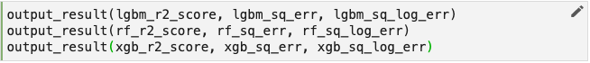
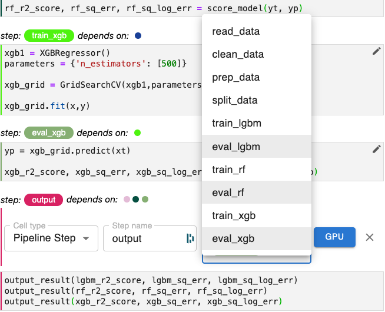
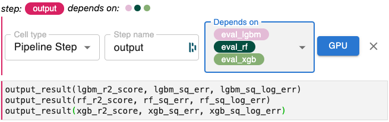

# Steps w/ Multiple Dependencies

In many cases, you’ll need to create a step that depends on two or more other
steps. Steps for producing output are one example. Let’s take a look at how to
set multiple dependencies by creating a final output step in our notebook.

!!! important "Follow Along"
    Please follow along and make the corresponding changes in your own copy of
    our notebook.

With the changes we’ve just made to create a *Functions* cell containing
functions for scoring and output to our notebook, each of our evaluation steps
now calls `output_results` as its last statement. We can see this, for example
in `eval_xgb`.

{: style="display: block; margin: auto; width:80%"}

Let’s move the calls to `output_results` from each of our evaluation steps to a
new step called output. Let’s place the cell as the very last cell in our
notebook. 

When we’ve finished moving the three `output_results` statements to this cell,
it should look like this.

{: style="display: block; margin: auto; width:80%"}

Now let’s annotate this cell as a *Pipeline Step* and set the dependencies.
Note that this step will depend on `eval_lgbm`, `eval_rf`, and `eval_xgb`
because it uses the values for each score metric from each of these steps.

The *Depends on* pull-down menu functions as a toggle. You may select as many
dependencies as required. You may unselect options by clicking that item again
in the pull-down menu. 

As depicted below, we’ll select the three eval steps as dependencies for our
new step, `output`.

{: style="display: block; margin: auto; width:80%"}

**If you make a mistake in selecting one of the dependencies, click the incorrect
dependency again in this pull-down and that item will be deselected.**

Once we’ve selected all the dependencies, we can click away from the pull-down
menu and you’ll see that all three evaluation steps have been selected as
dependencies.

{: style="display: block; margin: auto; width:80%"}
