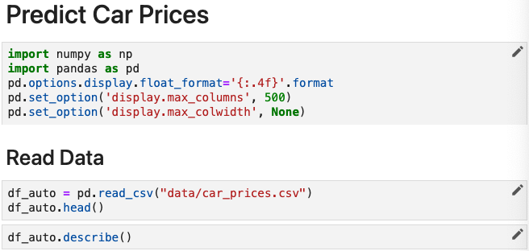
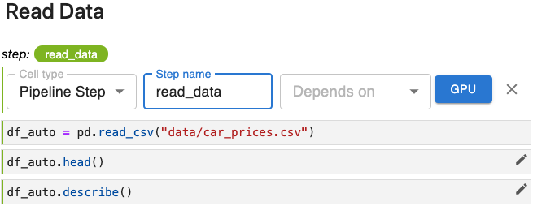

# Single-Cell Pipeline Steps

<iframe width="675" height="380" src="https://www.youtube.com/embed/wZ4NcD0cdGk?rel=0&more=0" title="YouTube video player" frameborder="0" allow="accelerometer; autoplay; clipboard-write; encrypted-media; gyroscope; picture-in-picture" allowfullscreen></iframe>

## Text Version of this Lesson

The first step of our workflow is reading data. That section of the notebook
looks like this.

{: style="display: block; margin: auto; width:80%"}

This line of code reads the dataset into a `pandas` data frame.

{: style="display: block; margin: auto; width:80%"}

When working with Kubeflow pipelines, it’s important to be specific about
exactly what code implements a pipeline step and to consider the modules on
which the code depends. We also need to consider the data inputs and outputs
for a given step. 

This step depends on the pandas module. It does not have any inputs since it
is the first step of our pipeline, but it does define and set the variable
`df_auto`, which will be used in many later steps. For purposes of Kubeflow
pipelines, `df_auto` is an output of this pipeline step.

To create our first pipeline step, we’ll do a small amount of reorganizing and
then apply a few annotations.

!!! important "Follow Along"
    Please follow along in your own copy of our notebook as we complete the steps
    below.

### Isolate the code for your step in one cell

Modify your code so that the line that reads the car_prices.csv file is in a
cell by itself.

{: style="display: block; margin: auto; width:80%"}

### Annotate the cell as a *Pipeline Step* and name it

Click the pencil icon on that cell and set the *Cell type* to *Pipeline Step*
and the *Step name* to `read_data`.

{: style="display: block; margin: auto; width:80%"}

Click the x to close the annotation editor.

Note that in addition to the label, `read_data`, this cell of our pipeline is
now marked with a vertical line that is the same color as the background of
the label, `read_data`.

If you look more closely, you’ll see that, in fact, all cells below this first
cell have been marked with a vertical line of the same color. 

The default behavior for Kale is that it automatically includes the cells that
follow a step cell as part of the same step until you specify otherwise by
supplying annotations later in the notebook.

In its current state, our entire notebook after the cell in which we read the
`car_prices.csv` file is a single pipeline step. Obviously, we don’t want the
entire notebook to be a single-step pipeline, but this Kale behavior does
provide an important convenience as we’ll see in a moment.

