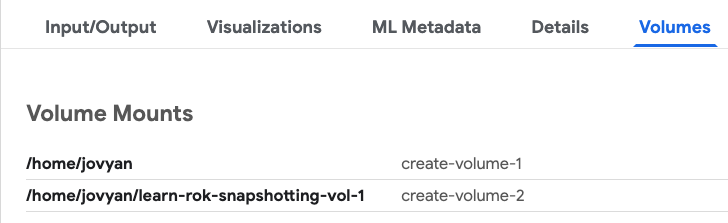

# Lab: Initial Volume Mounts
The initial Rok snapshots of workspace volume and data volume are mounted
to each of the containers that are created to process the Kubeflow pipeline steps.
pipeline steps. 

## Requirements 
Identify where these volumes are mounted by reviewing the `Volumes` tab for the `read_data` step. 

## Solution

??? success "View Solution"

     The volumes are mounted to the `home/jovyan` directory in the container. You can see mounts for each volume that Rok snapshotted in the initial snapshot steps in the Kubeflow pipeline.
     
