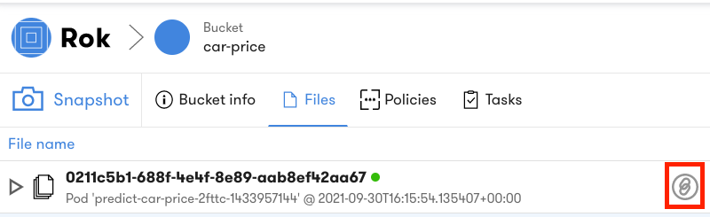
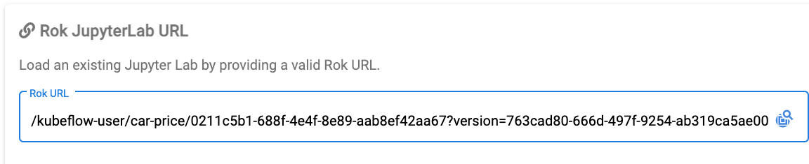

# Lab: Rok Snapshot Restoration
Rok Snapshots are stored in a Rok Bucket which can be referenced and restored during creation of a Notebook Server. 

## Requirements 
Create a new Notebook Server using the Rok Snapshot that was created during the *Rok Snapshot Basics* section. Confirm successful restoration by opening the Notebook. 

## Hint

??? hint "View Hint"
    - In the Rok Bucket you need to copy the Snapshot URL. 
    - In the Notebook Server Creation UI you need to paste the Rok URL.

## Solution

??? success "View Solution"

     First you must copy the snapshot URL.  

       

     Second you need to paste the URL when creating the Notebook Server.  

       

     Third confirm the load by navigating to the Notebook.  
     
       

