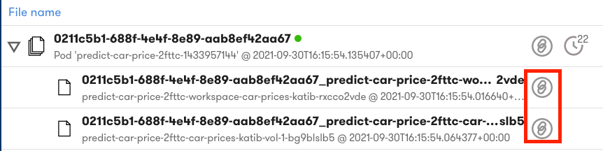
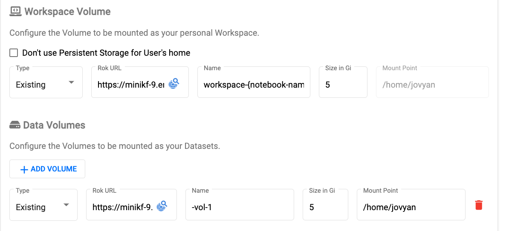
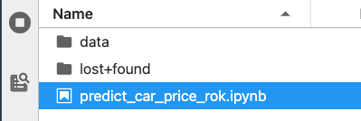

# Lab: Volume Snapshot Restoration
Rok Snapshots Sets are stored in a Rok Bucket and the specific workspace or data volume snapshot can be referenced and restored during creation of a Notebook Server. 

## Requirements 
Create a new Notebook Server using the workspace and data volume snapshot contained in the Rok Snapshot Set that was created during the *Rok Snapshot Basics* section. Confirm successful restoration by opening the Notebook. 

## Hint

??? hint "View Hint"
    - In the Rok Bucket you need to copy the Volume URL. 
    - In the Notebook Server Creation UI you need to paste the Rok URL for each volume.

## Solution

??? success "View Solution"

     First you must copy each volume URL.  

       

     Second you need to change the Workspace and Data Volume types to `Existing` and paste the respective URL into the `Rok URL` text box when creating the Notebook Server. You must not fill in the Rok URL at the Notebook Server level only fill in the volumes.  

       

     Third confirm the load by navigating to the Notebook.  
     
       

