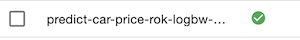
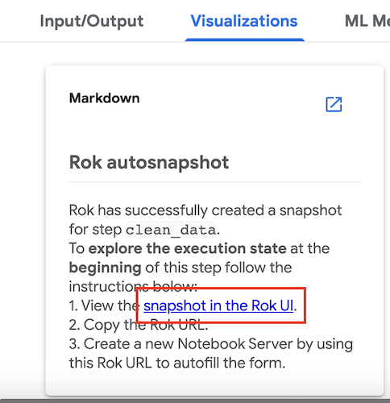
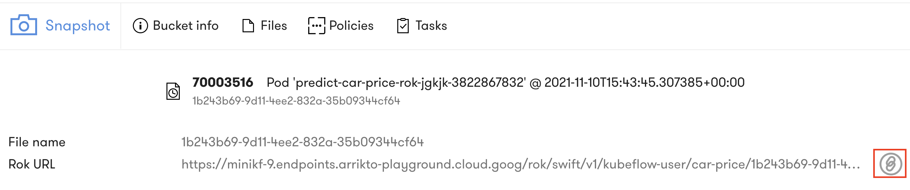
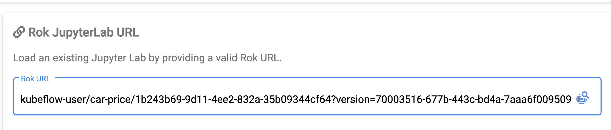
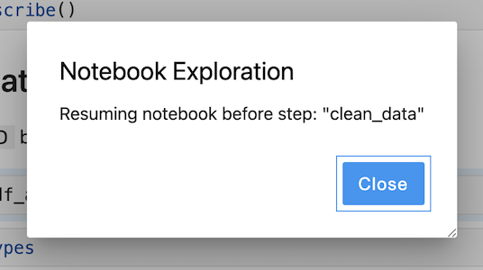

# Lab: Step Snapshot Restoration
Rok takes snapshots before and after each step in the Kubeflow pipeline. Step snapshots can be referenced and restored during the creation of a Notebook Server. This will restore the exact state of processing into the Notebook Server memory for the Notebook that is created with the snapshot. This way you can recreate the exact moment that the snapshot was taken during processing. 

## Requirements 
Create a new Notebook Server using the Snapshot for the `clean_data` step from the Kubeflow pipeline execution that was triggered during the *Rok Snapshot Basics* section. Confirm successful restoration by opening the Notebook.

## Hint

??? hint "View Hint"
    - In the `Runs` UI you need to select the run created during *Rok Snapshot Basics* and then select the `clean_data` step to access the Rok Snapshot. 
    - In the Notebook Server Creation UI you need to paste the Rok URL. 

## Solution

??? success "View Solution"

     First you must open the run from the `Runs` UI.  

     

     Second you need select the run that was generated during *Rok Snapshot Basics*.  

     

     Third select the `clean_data` step and select the `snapshot in the Rok UI` link from `Visualizations`.  
     
     

     Fourth copy the URL for the snapshot.   

     

     Fifth past the URL into the `Rok URL` box when creating a new Notebook Server.  

     

     Now confirm that the restoration was successful by opening the Notebook - you will see a message that the Notebook is resuming at the `clean_data` step.  

     
