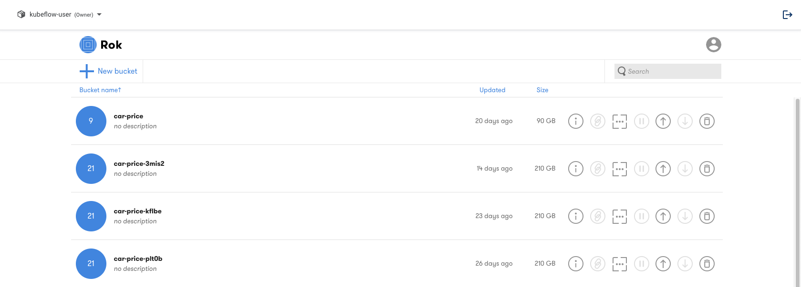
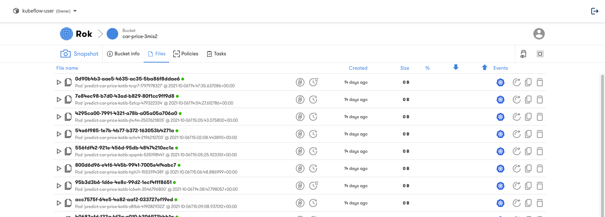
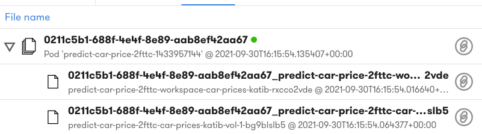

# Rok Bucket Basics

<iframe src="https://player.vimeo.com/video/648707401?h=d047cb11fc&amp;badge=0&amp;autopause=0&amp;player_id=0&amp;app_id=58479" frameborder="0" allow="autoplay; fullscreen; picture-in-picture" allowfullscreen style="position:absolute;top:0;left:0;width:100%;height:100%;" title="Rok Bucket Basics.mov"></iframe>

## Buckets and Snapshots
To create a snapshot, Rok hashes, de-duplicates, and versions snapshots and then stores the de-duplicated, content-addressable parts on an Object Storage service (e.g., Amazon S3) that is close to the specific Kubernetes cluster. Rok creates Buckets of Snapshots which are associated with a specific set of Kubeflow pipeline runs. Snapshots are taken at the start of execution and before and after each steps, however taking snapshots does not impact application performance. Snapshotting happens outside the application I/O path using Arrikto’s Linux kernel
enhancements contained in the Arrikto provided Docker images. These
enhancements are loaded as modules into the kernel during the creation of the
Rok Cluster. As a result, snapshotting will not impact performance of
applications in the Pods.

!!! important "Follow Along"
    Please follow along in your own copy of our notebook as we complete the steps below.

### 1. Open Snapshots
In the Kubeflow UI select `Snapshots` to view the Rok buckets that have been created.

### 2. Open Bucket
Expanding a bucket will show the list of snapshots that have been taken during Kubeflow pipeline execution. Each Kubeflow Pipeline run is associated with a Rok bucket. In the Snapshots UI select the newly created bucket to view the snapshots created during execution of the Kubeflow pipeline.

### 3. Expand a Snapshot
Expand the first snapshot to see the volumes that have been captured.

