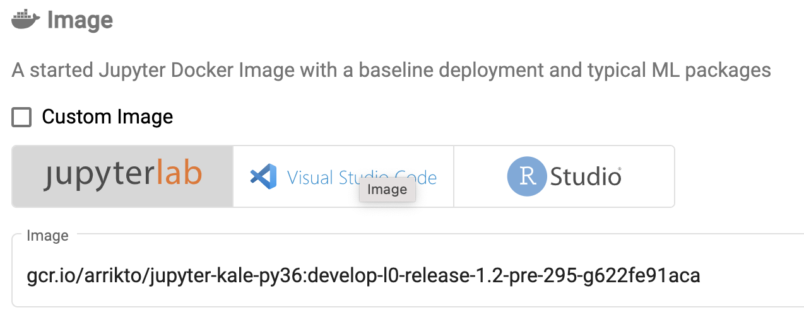
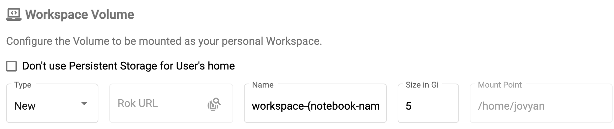
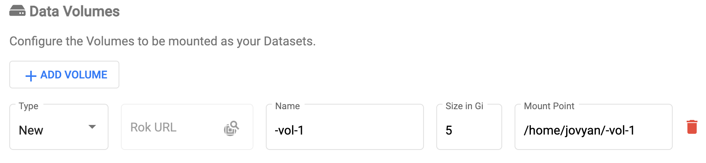

# Rok Cluster Overview

## Kubernetes Pods
Kubeflow runs in Kubernetes clusters as a collection of Pods. [Pods](https://kubernetes.io/docs/concepts/workloads/pods/) are a group of one or more containers, with shared storage and network resources, and a specification for how to run the containers. Kubeflow provides [Docker images](https://github.com/kubeflow/kubeflow/tree/master/components/example-notebook-servers) to run JupyterLab Notebooks (and other applications) in Kubernetes Pods. The NotebookServer, with Kale installed, runs as a Pod in the Kubernetes user’s namespace. Arrikto makes this possible with [Kale Docker Images](https://github.com/kubeflow-kale/kale/blob/master/docker/jupyterlab/Dockerfile.rok.dev), such as the one you selected during Notebook Server creation.

During Notebook Server creation and during execution of Kubeflow pipelines facilitated by Kale the Kubernetes Pods will request storage with a [PersistentVolumeClaim](https://kubernetes.io/docs/concepts/storage/persistent-volumes/) and will host [PersistentVolumes](https://kubernetes.io/docs/concepts/storage/persistent-volumes/) that are provisioned in response. The Rok driver, rok-csi, prepares this volume and mounts it under the user’s home directory by default. This volume hosts and stores user added code and libraries.

The Rok driver (rok-csi) also provisions and mounts additional volumes, called data volumes, at locations of your choice during Notebook Server creation.

## Rok Cluster
Rok is present on every node in a MiniKF or Enterprise Kubeflow cluster. Rok’s presence enables you to create snapshots of local PersistentVolumes to capture point in time representation of volume storage.

In addition to the Rok driver, the rok-operator Pod (not displayed in image) sits in the Kubernetes Cluster and serves as the orchestrator of the Rok nodes. The rok-operator communicates and synchronizes the Rok Pods across the cluster. This collection of Rok Pods with the rok-operator and rok-csi driver is often referred to as a Rok Cluster.

## Rok & Notebook Server
During Notebook Server creation and during execution of Kubeflow pipelines facilitated by Kale, the Kubernetes Pods will request storage with a PersistentVolumeClaim and will host PersistentVolumes that are provisioned in response. The Rok driver, rok-csi, prepares and mounts the initial PersistentVolume under the user’s home directory by default. The initial PersistentVolume, called the workspace volume, hosts and stores user added code and libraries. The Rok driver (rok-csi) also provisions and mounts additional volumes, called data volumes, at locations of your choice during Notebook Server creation.
