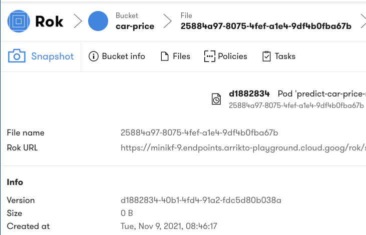

# Rok Snapshot Basics

<iframe src="https://player.vimeo.com/video/648707386?h=798b7a6581&amp;badge=0&amp;autopause=0&amp;player_id=0&amp;app_id=58479" frameborder="0" allow="autoplay; fullscreen; picture-in-picture" allowfullscreen style="position:absolute;top:0;left:0;width:100%;height:100%;" title="Snapshotting Basics"></iframe>

Kale generates Kubeflow pipelines from tagged cells in the JupyterLab Notebook, which has a default workspace volume and one or more default data volumes. Arrikto does recommend defining at least one data volume during Notebook Server creation. When a Kubeflow pipeline is instantiated, Rok will snapshot all Notebook volumes and then clone them for the pipeline steps to use them. By seamlessly cloning the workspace and data volumes, your environment is versioned and replicated to the new pipeline which is then executed. 

## Initial Rok Snapshots
To view the Rok Snapshot steps open the Kubeflow pipeline generated by the Katib experiment. 

!!! important "Follow Along"
    Please follow along in your own copy of our notebook as we complete the steps below.

### 1. Run Kubeflow Pipeline
To begin execute the Kubeflow pipeline generated by the Kale tags already present in the Notebook by selecting `COMPILE AND RUN`.

### 2. Review Initial Snapshot
To view the details of the initial Rok snapshot select the `Done` option next to the `Taking snapshot` step of the Kubeflow pipeline.

 

The snapshot details will be displayed on screen.

 

### 3. Review Snapshot Metadata
Scroll down to review the snapshot metadata.

 

### 4. Review Snapshot Steps
Return to the Notebook and select the `View` option next to the `Running pipeline` step of the Kubeflow pipeline. 

 

In the Kubeflow pipeline you will see a step called `create-volume-1`, this is the step responsible for provisioning a clone of the Notebook’s workspace volume. If there are data volumes attached to the Notebook then you will see one step per data volume labelled as `create-volume-#`. 

 

## Kale Marshal Volumes

There are two important reasons for this duplication process.

1. Marshalling: a mechanism to seamlessly pass data between steps. Kale uses a hidden folder within the workspace volume as the shared marshalling location to serialize and deserialize data.
2. Reproducibility, experimentation: when working on a Notebook, it is often the case that you install new libraries, write new modules, create or download assets required by your code. By seamlessly cloning the workspace and data volumes, all your environment is versioned and replicated to the new pipeline. 

The newly duplicated volumes are mounted by the rok-csi driver to the container in which the pipeline steps run. You can select the pipeline step cell and select volumes to see where the dependent volumes are mounted. 

## Pipeline Step Snapshots
Rok takes snapshots just before and just after execution of individual pipeline steps. This functionality allows you to restore not just an environment but the execution state of a Kubeflow pipeline initiated by Kale from within a JupyterLab Notebook.

### 5. Review Step Snapshot
Select the `read_data` Kubeflow pipeline step. Then select the `Visualizations` option on the right to see the snapshot acknowlegement. 

### 6. Review Snapshot Details
Select the `snapshot in Rok UI` link to view the snapshot details. 

The snapshot details will open in the browser.  

