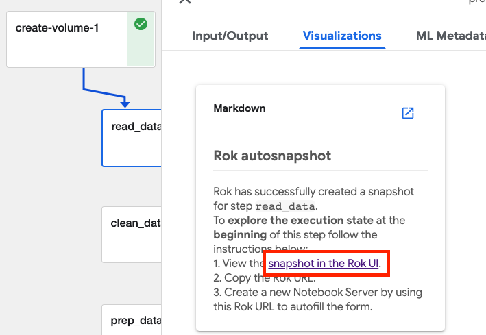

# Rok Snapshot Restoration

<iframe src="https://player.vimeo.com/video/648707416?h=4f3d0058a0&amp;badge=0&amp;autopause=0&amp;player_id=0&amp;app_id=58479" frameborder="0" allow="autoplay; fullscreen; picture-in-picture" allowfullscreen style="position:absolute;top:0;left:0;width:100%;height:100%;" title="Rok Snapshot Restoration Part 1.mov"></iframe>

## Rok Bucket URL 

Rok snapshots provide the ability to version entire environments much in the same way that you can version code with Git. Rok snapshots enable you to iterate on your environment as you transform datasets, develop models, and develop other aspects of an ML workflow. The pipeline is always reproducible, thanks to the immutable snapshots, and you do not have to build new Docker images for each pipeline run. 

## Rok Snapshot URL 
Rok enables restoring snapshots in their entirety on new Notebook Servers. This enables you to recreate a complete environment exactly the way it was at any point in time. To do this you need to copy the URL from the Rok Snapshot. 

With the URL copied you can provide the Rok Snapshot as reference when creating a new Notebook Server. If the URL is accepted you will see a notification as shown in the image below:

## Rok Volume URL 
Rok permits loading specific volumes from snapshots during creation of the Notebook Server. This can be done with either the workspace volume or the data volume. As with the entire snapshot each of the volumes has a specific URL with the workspace volume always first in the list of snapshot volumes.

You can then specify this URL for either workspace or data volume by selecting `Existing` and specifying the URL when creating the Notebook Server and adding volumes to it.

## Rok Snapshot URL

<iframe src="https://player.vimeo.com/video/648707428?h=1254680d61&amp;badge=0&amp;autopause=0&amp;player_id=0&amp;app_id=58479" frameborder="0" allow="autoplay; fullscreen; picture-in-picture" allowfullscreen style="position:absolute;top:0;left:0;width:100%;height:100%;" title="Rok Snapshot Restoration Part 2"></iframe>

Rok also permits loading the snapshot taken before or after the execution of pipeline steps into a Notebook Server to recreate the captured execution state. The snapshot and the associated URL can be accessed from the “snapshot in the Rok UI” link under the Visualizations option in the Kubeflow UI.

Once the snapshot is open you can copy the URL by selecting the copy icon.

