# Get Dataset and Code

To work through this module you will need the code and data we have provided.
Please download and unzip the [handout](handouts/rok-snapshotting-handouts.zip).

## Upload the handout files

Once you’ve unzipped the handout, you should see the following files.

#### 1. Review the handout files

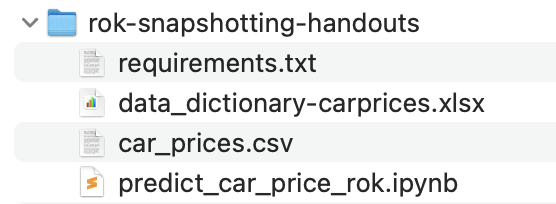
{: style="display: block; margin: auto; width:80%"}

`car_prices.csv` is our data file.

`data_dictionary-carprices.xlsx` provides some explanatory detail on our
dataset.

`predict_car_price.ipynb` is a notebook containing Python code that builds and
evaluates three models for predicting car prices based on our dataset. We will
modify the code in small ways and annotate this notebook to define and run a
Kubeflow pipeline!

`requirements.txt` lists the Python modules required for our notebook. We'll
use this file to install those requirements in a later step.

#### 2. Open the learn-rok-snapshotting-vol-1 folder

Double-click on the directory, `learn-rok-snapshotting-vol-1`. Note that this is
the name of the data volume you added to your notebook server previously. If you
named your notebook differently, then you will be seeing a different folder name
here.

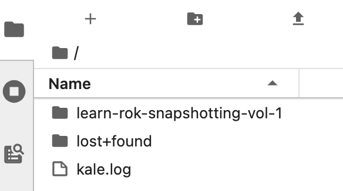
{: style="display: block; margin: auto; width:80%"}

#### 3. Click the file upload button

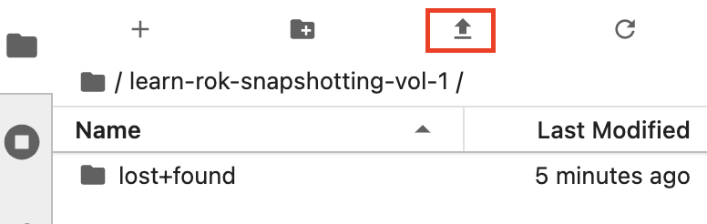
{: style="display: block; margin: auto; width:80%"}

#### 4. Upload handout files

 In the file dialog that pops up, select the handout files you unzipped
 and upload them to your Jupyter notebook environment.

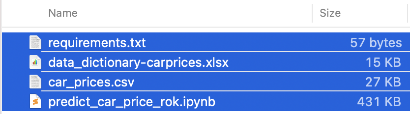
{: style="display: block; margin: auto; width:80%"}

You will see them appear in the `learn-rok-snapshotting-vol-1` directory.

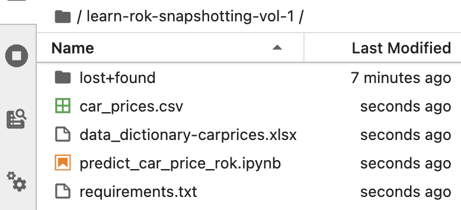
{: style="display: block; margin: auto; width:80%"}

#### 5. Create a new folder

Click the button to create a new folder.

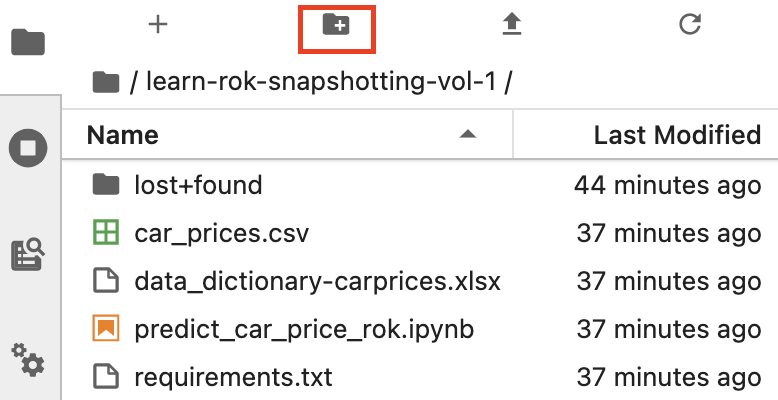
{: style="display: block; margin: auto; width:80%"}

#### 6. Name the folder "data"

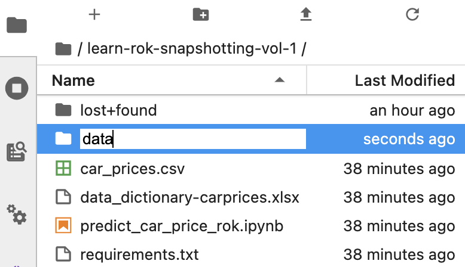
{: style="display: block; margin: auto; width:80%"}

#### 7. Move data files

Drag and drop `car_prices.csv` and `data_dictionary-carprices.xlsx` into the
data folder.

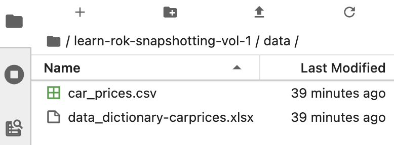
{: style="display: block; margin: auto; width:80%"}

#### 8. Open our notebook

Double-click `predict_car_price_rok.ipynb` in the file browser pane.

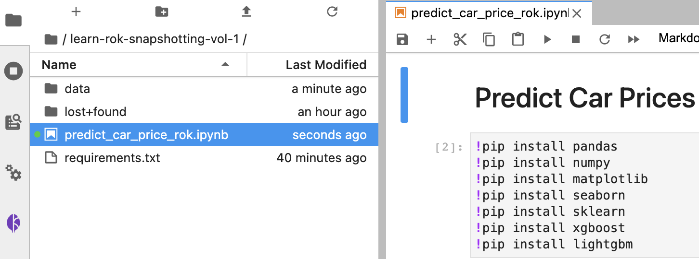
{: style="display: block; margin: auto; width:80%"}

#### 9. Enable Kale

Click the *Enable* toggle in the *Kale Deployment panel* to enable Kale.

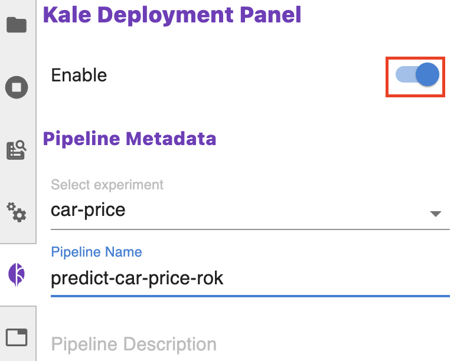
{: style="display: block; margin: auto; width:80%"}

### 10. Launch a Terminal

Click the `Launcher` tab and launch a `Terminal`.

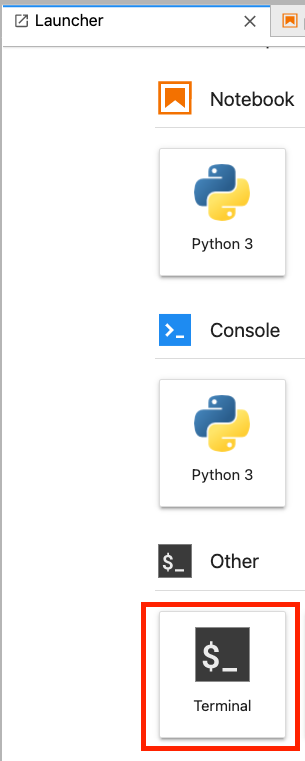
{: style="display: block; margin: auto; width:80%"}

### 11. Install Requirements

In the terminal enter the following commands.

Change to the learn-rok-snapshotting-vol-1 directory.

`cd learn-rok-snapshotting-vol-1`

Install the Python modules required by this notebook.

`pip install -r requirements.txt`

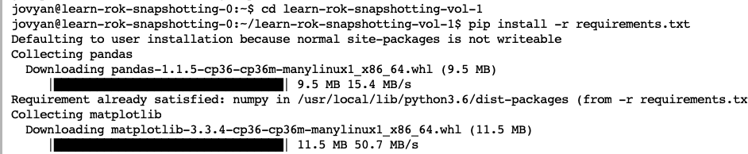
{: style="display: block; margin: auto; width:80%"}

#### 12. Restart the Kernel

In the `predict_car_price.ipynb` notebook, restart the kernel.

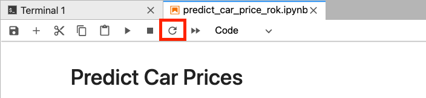
{: style="display: block; margin: auto; width:80%"}
